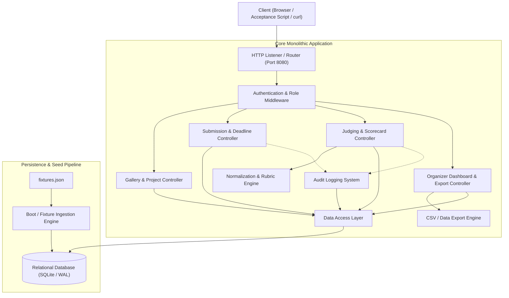
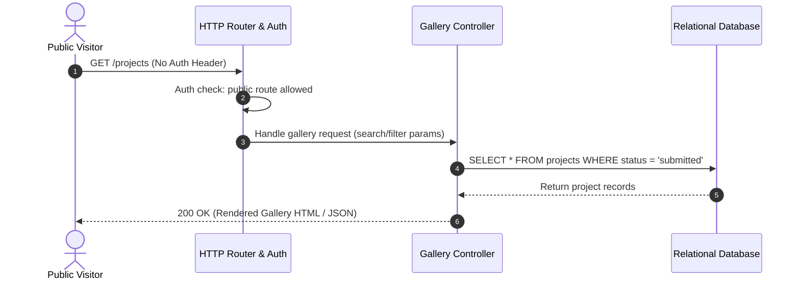
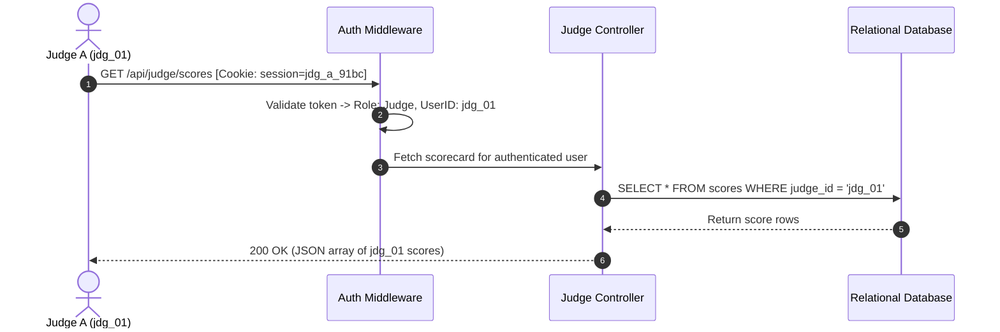
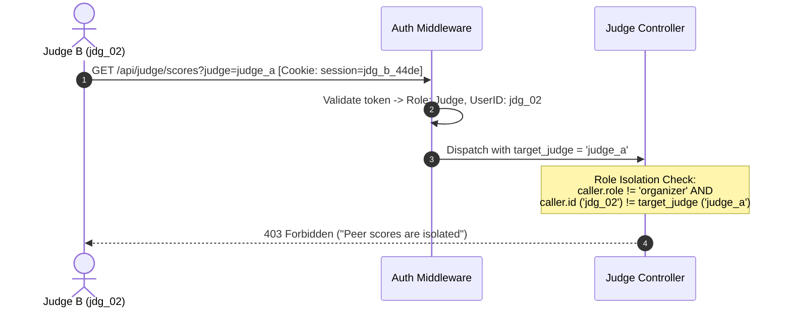
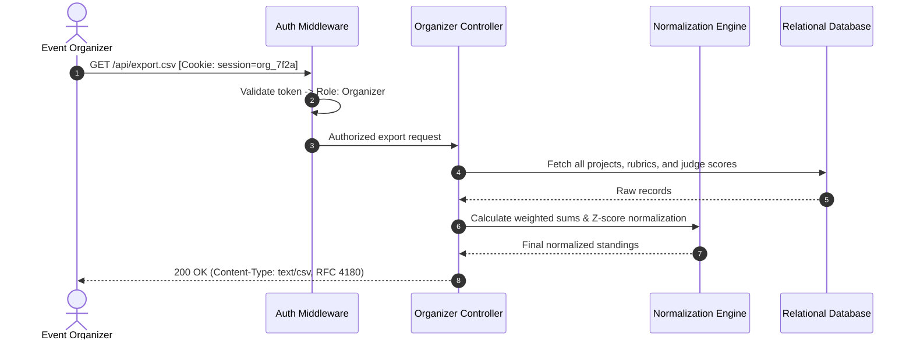
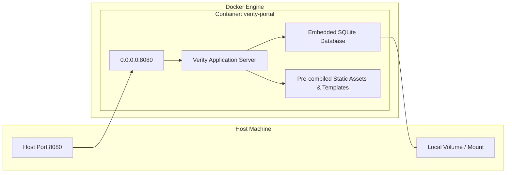
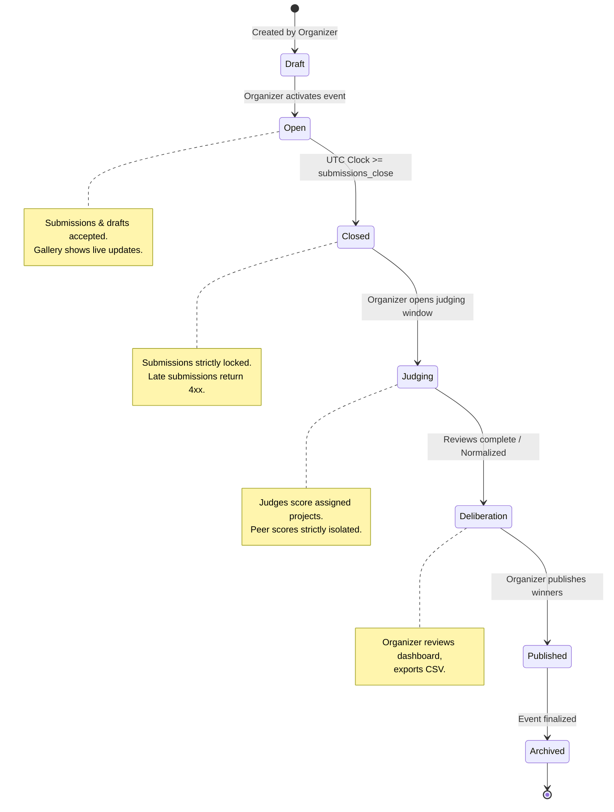
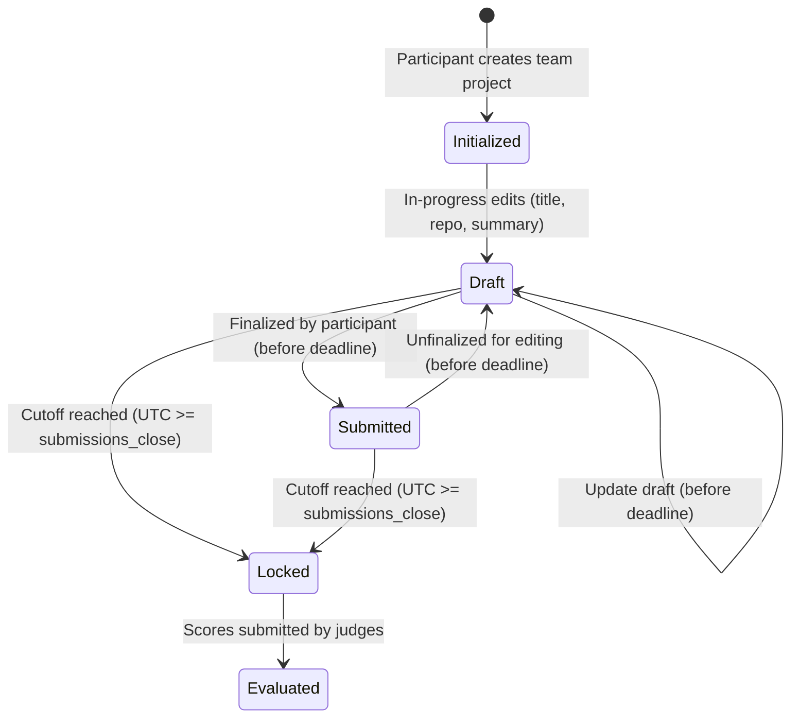
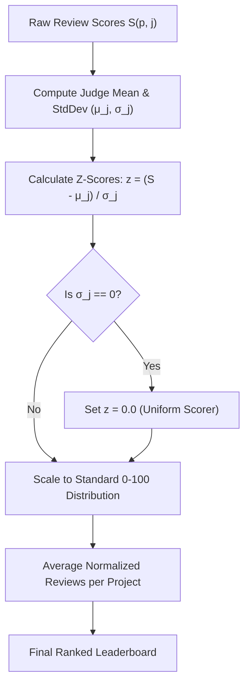
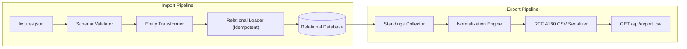

# Verity: Architectural Design and System Specification

> **Event Context**: DOGFOOD 2026 Hackathon  
> **Challenge**: "Build the platform that will judge you."  
> **Repository**: [`techoprohit/Verity`](https://github.com/techoprohit/Verity)  
> **Document Status**: Design Specification and Architectural Blueprint

---

## 1. Architecture Overview

Verity is designed as a lightweight, robust, self-hostable hackathon management and judging platform. It satisfies the core DOGFOOD requirement of the **One Command Rule**: running entirely offline on a developer's laptop with zero external cloud dependencies.

### Technology Stack

| Layer | Technology | Rationale |
| :--- | :--- | :--- |
| **Runtime** | Node.js v22 | Cross-platform, single-language full-stack, native `--watch` for dev |
| **HTTP Framework** | Express.js 4.x | Minimal, proven, zero-magic routing and middleware pipeline |
| **Database** | SQLite via `better-sqlite3` | Embedded, zero-config, WAL mode for concurrent reads, instant boot |
| **Frontend** | Vanilla HTML / CSS / JS | No build step, no bundler, zero external CDN calls, true offline |
| **Containerization** | Docker + Docker Compose | One-command deployment satisfying the DOGFOOD offline mandate |

> **Project Design Decision:** React, Next.js, and similar SPA frameworks were intentionally avoided. They introduce build pipelines, hydration delays, and large `node_modules` footprints that conflict with the hackathon's emphasis on instant boot, offline operation, and correctness over breadth.

### Current Implementation vs. Architectural Target
- **Current State in Repository**: The project scaffold is in place: Express server ([`src/server.js`](file:///d:/Code/DogFood/Verity/src/server.js)), SQLite connection with WAL mode ([`src/db/database.js`](file:///d:/Code/DogFood/Verity/src/db/database.js)), authentication middleware ([`src/middleware/auth.js`](file:///d:/Code/DogFood/Verity/src/middleware/auth.js)), route stubs ([`src/routes/`](file:///d:/Code/DogFood/Verity/src/routes/)), Docker deployment files, and `npm install` confirmed. Schema, seeding, controllers, frontend, and tests are under active development.
- **Architectural Scope**: This document specifies the complete system architecture, data flow, security model, and component interactions required to implement Tiers 1 through 4 cleanly within the 72-hour hackathon window.

### Major System Components



### Component Details
1. **Frontend**:
   - Vanilla HTML/CSS/JS served as static assets from the `public/` directory by Express.
   - Zero external CDN dependencies (no Google Fonts, unbundled Tailwind scripts, or third-party JS). All styling and interactivity are bundled locally to guarantee offline operation.
   - CSS-first animations and transitions (GPU-accelerated, non-blocking). No JavaScript animation libraries.
   - Paginated gallery loading and `loading="lazy"` for media to keep pages lightweight.
2. **Backend**:
   - A single monolithic Node.js + Express application service (*Project Design Decision*).
   - Handles route dispatch, session resolution, authorization gating, business logic (deadline enforcement, weighted scoring, normalization), and data serialization.
3. **Database**:
   - Embedded relational database (*Project Design Decision: SQLite with Write-Ahead Logging enabled*).
   - Guarantees strict ACID transactions for score submissions and edits without requiring a separate network-attached database container.
4. **Authentication & Session Layer**:
   - Deterministic session resolution layer reading standard HTTP headers (`Cookie: session=...` or `Authorization: Bearer ...`).
   - Automatically initializes pre-seeded session tokens for designated roles (`organizer`, `judge_a`, `judge_b`, `participant`) upon startup, matching `.dogfood.toml`.
5. **Background Jobs**:
   - **None** (*Project Design Decision*).
   - All operations (rubric calculation, Z-score normalization, CSV generation, fixture seeding) run synchronously within HTTP request cycles or at container startup. This avoids job broker dependencies (Redis, Celery, RabbitMQ) that jeopardize offline reproducibility.
6. **Import / Export Components**:
   - **Ingestion Pipeline**: Parses and transforms `fixtures.json` into relational schema entities on boot.
   - **CSV Export Engine**: Streams RFC 4180-compliant comma-separated data containing project rankings, raw scores, and normalized evaluations directly over `GET /api/export.csv`.
7. **Audit System**:
   - Append-only database ledger recording significant mutations: score creation, score updates, project status changes, and unauthorized access attempts.

---

## 2. Request and Data Flows

### Flow 1: Public Visitor Browsing Gallery
A visitor discovers projects without authentication.



### Flow 2: Participant Submitting a Project
A participant submits or updates their project draft, subject to deadline enforcement.

```mermaid
sequenceDiagram
    autonumber
    actor Participant as Team Member
    participant Server as Auth Middleware
    participant SubCtrl as Submission Controller
    participant Clock as UTC System Clock
    participant DB as Relational Database

    Participant->>Server: POST /projects/new [Cookie: session=prt_2e88]
    Server->>Server: Resolve session -> Participant (tm_01)
    Server->>SubCtrl: Process submission payload
    SubCtrl->>DB: Query event.submissions_close
    DB-->>SubCtrl: Timestamp (e.g. 2026-03-01T18:00:00Z)
    SubCtrl->>Clock: Current UTC Time >= submissions_close?
    alt Deadline Passed (Event Closed)
        SubCtrl-->>Participant: 400/403 Bad Request / Forbidden ("Submissions are closed")
    else Deadline Active (Event Open)
        SubCtrl->>DB: UPSERT project record (title, summary, repo_url)
        DB-->>SubCtrl: Confirmation
        SubCtrl-->>Participant: 200 OK / 201 Created (Draft Saved)
    end
```

### Flow 3: Judge Reading Their Own Scores
A judge queries their submitted evaluations.



### Flow 4: Judge Attempting to Access Another Judge's Scores
A peer judge attempts to inspect another judge's scorecards via query parameters or path variables.



### Flow 5: Organizer Exporting Results
An organizer requests the final aggregated and normalized scorecard.



---

## 3. Deployment Architecture

Verity operates under the strict **DOGFOOD One Command Rule**:
> *"If it does not come up on a laptop with the network off, we cannot adopt it, and adoption is the entire point."*



### Deployment Properties
- **Container Structure**: A single self-contained container running the application binary or runtime.
- **Port Binding**: Binds container port `8080` directly to `localhost:8080`.
- **Volumes**: Optional persistent volume (`/data`) storing the database file across container stops, allowing clean resets via `docker compose down -v`.
- **Database Model**: Embedded database file. Eliminates inter-container network initialization races and removes health-check polling loops.
- **Network Isolation**: All container egress can be disabled (`internal: true` or zero outbound network bridge). The application makes zero outbound HTTP requests during runtime.
- **What `docker compose up` Executes**:
  1. Compiles/starts the application daemon.
  2. Runs relational schema migrations automatically.
  3. Checks database state; if empty, ingests `fixtures.json`.
  4. Pre-configures static sessions (`org_7f2a`, `jdg_a_91bc`, `jdg_b_44de`, `prt_2e88`).
  5. Binds listener to `0.0.0.0:8080` and begins serving requests immediately.

---

## 4. Authentication and Authorization

### Session and Token Model
- Verity implements a deterministic session resolver designed for automated testing, offline evaluation, and zero-friction developer verification.
- **Header Parsing**: The authentication middleware extracts credentials from:
  1. `Cookie: session=<token>`
  2. `Authorization: Bearer <token>`
- **Pre-Configured Static Personas**:
  - `org_7f2a` $\rightarrow$ Role: `organizer`, User: `Organizer Admin`
  - `jdg_a_91bc` $\rightarrow$ Role: `judge`, User: `Ada Okonkwo` (`jdg_01`)
  - `jdg_b_44de` $\rightarrow$ Role: `judge`, User: `Peer Judge` (`jdg_02`)
  - `prt_2e88` $\rightarrow$ Role: `participant`, User: `Team Lead` (`tm_01`)

### Role Resolution Hierarchy
Requests are categorized into one of five explicit roles:
1. `visitor`: No credentials provided. Permitted read-only access to `/projects` and public project profiles.
2. `participant`: Associated with a team. Permitted to create and edit their team's project draft prior to cutoff. Forbidden from judging endpoints.
3. `judge`: Associated with judging assignments. Permitted to read and write evaluations strictly for their assigned queue.
4. `organizer`: Full event administration privileges. Permitted to view progress dashboards, access all scorecards, re-run normalization, and download CSV exports.
5. `admin`: System-level maintenance and event configuration.

### Why Direct curl/API Requests Cannot Bypass Restrictions
In Verity, security is **never implemented via frontend template conditionals alone**.
- **Backend Filter Enforcement**: Authorization checks execute inside HTTP middleware and controller guards before any database interaction or business logic executes.
- **Direct Route Inspection**:
  - If a user sends:
    ```bash
    curl -H "Cookie: session=prt_2e88" http://localhost:8080/api/judge/scores
    ```
    The middleware determines the identity has role `participant`. The route guard requires role `judge` or `organizer`. The server terminates the connection with `403 Forbidden` without querying the database.
- **Identity Matching for Peer Isolation**:
  - If Judge B sends:
    ```bash
    curl -H "Cookie: session=jdg_b_44de" "http://localhost:8080/api/judge/scores?judge=judge_a"
    ```
    The controller verifies that the target identifier (`judge_a`) does not match the caller's identity (`jdg_b_44de` / `jdg_02`), and caller is not an organizer. The request is denied with `403 Forbidden`.

---

## 5. Event Lifecycle State Model

The event state engine manages transitions based on configuration and the immutable UTC system clock:



### State Guard Rules:
- **`submissions_close` Guard**: Applied on every `POST`/`PUT` to submission endpoints. If current UTC time is equal to or greater than `event.submissions_close`, state evaluates to `Closed`, and the request fails.
- **Results Visibility Guard**: Community vote totals and judge scorecards are masked from public API queries until state advances to `Published`.

---

## 6. Submission Lifecycle

A submission represents a team's hackathon project entry.



### Lifecycle Constraints:
1. **Ownership Guarantee**: A project can only be modified by members of the assigned team (`team_id`).
2. **Draft Mutability**: Teams can repeatedly modify fields (title, summary, repo URL, demo link) while the event remains `Open`.
3. **Hard Lockout**: Once the deadline passes, status transitions to `Locked` across all write paths.

---

## 7. Judging Architecture

### 1. Judge Assignment
- Judges are mapped to tracks and projects via explicit assignments (`judge_assignments` table).
- When a judge opens their dashboard, the query fetches only projects belonging to their assigned queue.

### 2. Configurable Weighted Rubric
Organizers configure rubric criteria per event or per track. Each criterion $c_i$ defines:
- A key (e.g. `functionality`, `code_quality`, `design`, `originality`)
- A display label
- A weight multiplier $w_i \in \mathbb{R}^+$ (e.g., Functionality = 40%, Code Quality = 30%)
- A score range (typically 1 to 5)

### 3. Score Storage
Each submitted review persists:
- `judge_id`: References the evaluating judge.
- `project_id`: References the evaluated project.
- `criteria_scores`: Key-value JSON or relational rows capturing numerical ratings for each criterion.
- `comment`: Qualitative feedback (optional, accepts empty text without errors).
- `submitted_at`: Immutable UTC timestamp.

### 4. Normalization Engine (Z-Score Standardization)
To mitigate inter-judge variance (preventing harsh judges from sinking good projects and lenient judges from elevating mediocre ones), Verity implements **Z-Score Normalization**:



#### Normalization Formulation:
1. **Raw Weighted Review Score**:
   $$S_{p, j} = \frac{\sum_{i=1}^k (w_i \cdot s_{i, p, j})}{\sum_{i=1}^k w_i}$$
2. **Judge Sample Mean and Variance**:
   $$\mu_j = \frac{1}{N_j} \sum_{p=1}^{N_j} S_{p, j}, \quad \sigma_j = \sqrt{\frac{1}{N_j} \sum_{p=1}^{N_j} (S_{p, j} - \mu_j)^2}$$
3. **Normalized Project Score**:
   If $\sigma_j > 0$:
   $$z_{p, j} = \frac{S_{p, j} - \mu_j}{\sigma_j}$$
   If $\sigma_j = 0$ (judge gave identical scores to all assigned projects), $z_{p, j} = 0$.
4. **Rescaled Score**:
   $$S_{norm}(p, j) = \mu_{global} + (z_{p, j} \cdot \sigma_{global})$$
5. **Project Final Score**:
   $$\text{FinalScore}(p) = \frac{1}{M_p} \sum_{j=1}^{M_p} S_{norm}(p, j)$$
   *(where $M_p$ is the number of reviews received by project $p$)*.

### 5. Audit Trail
All score insertions and modifications create an immutable audit record:
- `action`: `SCORE_CREATE` / `SCORE_UPDATE`
- `actor_id`: Authenticated user ID
- `target_project_id`: Project ID
- `previous_values` / `new_values`: JSON payload diff
- `timestamp`: UTC timestamp

---

## 8. Import / Export Architecture



### `fixtures.json` Ingestion
- **Idempotent Ingestion**: Ingestion checks for existing primary keys before insertion, preventing duplicate key violations on container restarts.
- **Relational Integrity**: Entities are inserted in strict dependency order:
  1. `events`
  2. `tracks`
  3. `judges` (Users with role `judge`)
  4. `teams`
  5. `projects`
  6. `scores`

### CSV Export (`GET /api/export.csv`)
- Strictly restricted to authenticated `organizer` sessions.
- Generates RFC 4180-compliant comma-separated output:
  - Header: `project_id,title,team_name,track,review_count,raw_average,normalized_score,status`
  - Body: One line per project, properly quoting strings containing commas or quotation marks.

---

## 9. Security Architecture and Decisions

| Security Area | Implementation Choice | Specification Requirement vs. Project Design Decision | Rationale |
| :--- | :--- | :--- | :--- |
| **Authentication** | Static & token-based session resolution | *Project Design Decision* (satisfies DOGFOOD acceptance format) | Eliminates external auth providers; ensures zero network dependencies and instantaneous testability. |
| **Peer Isolation** | Controller-level identity matching returning HTTP 403 | **DOGFOOD Requirement** | Prevents curl/API inspection of peer scores; guarantees judging fairness. |
| **Deadline Validation** | UTC server clock comparison on write routes | **DOGFOOD Requirement** | Guarantees late submissions cannot bypass deadline via client-side clock tampering. |
| **Input Sanitization** | Strict JSON schema parsing and HTML entity encoding | *Project Design Decision* | Mitigates Stored XSS in public gallery and project summary fields. |
| **Rate Limiting** | In-memory token bucket on submission endpoints | *Project Design Decision* (T3 stretch) | Protects against automated ballot stuffing and request flooding. |
| **Audit Logging** | Append-only database ledger | *Project Design Decision* | Provides verifiable trail of score changes during organizer deliberation. |

---

## 10. Failure and Edge Cases Handling

The architecture explicitly accounts for the intentional edge cases present in the DOGFOOD specification and fixture data:

| Failure / Edge Case | System Behavior and Architectural Defense |
| :--- | :--- |
| **Missing Review Scores** | Projects receive varying review counts (e.g. 2 reviews vs. 5 reviews). Normalization calculates averages across completed reviews without penalizing projects for unassigned or unfinished judge batches. |
| **Incomplete Judging Batches** | Judges who leave batches partially finished do not block leaderboard calculation. All completed reviews remain valid and normalized. |
| **Uniform-Scoring Judge ($\sigma = 0$)** | A fixture judge gives identical scores to all projects. Division by zero in standard deviation calculation is intercepted; the judge's Z-score delta is set to $0.0$. |
| **Duplicate Submissions** | The schema enforces unique constraints on `(team_id, event_id)`. Re-submitting updates the existing draft rather than creating orphan duplicate projects. |
| **Submission After Cutoff** | The backend compares `event.submissions_close` to current UTC time. Any post-cutoff POST request is rejected with `4xx` immediately. |
| **Invalid or Spoofed Roles** | Unrecognized session tokens default to anonymous visitor context. Attempting to call protected judge or organizer routes returns HTTP 401 or 403. |
| **Missing `fixtures.json` File** | The bootstrapper checks for fixture file availability; if missing, logs a descriptive warning and boots an empty schema rather than crashing with an unhandled exception. |

---

## 11. Important Design Decisions and Tradeoffs

### Decision 1: Monolithic Architecture vs. Microservices
- **Problem**: Need to coordinate gallery, submissions, judging, and exports under strict 72-hour timeline and single-command offline constraints.
- **Chosen Solution**: Single monolithic service.
- **Alternatives Considered**: Separating into Auth Service, Judging Engine, and Gallery Frontend.
- **Reason for Choice**: Microservices introduce inter-process networking, container orchestration complexity, and network failure modes that violate the "simple and reliable" DOGFOOD ethos.
- **Tradeoff**: Vertical scaling only; cannot scale the judging component independently of the gallery (irrelevant for hackathon scale).

### Decision 2: Embedded Relational Database (SQLite) vs. External Database Service (PostgreSQL)
- **Problem**: Need ACID compliance for scoring while supporting one-command offline boot without container health-check delays.
- **Chosen Solution**: Embedded SQLite with WAL mode enabled.
- **Alternatives Considered**: Separate PostgreSQL container in `docker-compose.yml`.
- **Reason for Choice**: Single-file storage eliminates port collision risks, external container health dependencies, and networking misconfigurations.
- **Tradeoff**: Lower concurrent write throughput compared to dedicated PostgreSQL, but easily exceeds hackathon workload requirements (<50 concurrent writes/sec).

### Decision 3: Deterministic Header Sessions vs. OAuth/Dynamic Passwords
- **Problem**: The DOGFOOD acceptance checker (`run.py`) validates role isolation by supplying static headers without performing browser-based interactive logins.
- **Chosen Solution**: Header-based session mapper (`Cookie: session=...`).
- **Alternatives Considered**: Dynamic OAuth2/OIDC provider or full email/password verification flow.
- **Reason for Choice**: The acceptance checker requires pre-authenticated headers in `.dogfood.toml`. Pre-seeding these tokens allows instantaneous automated testing while supporting standard cookie sessions for humans.
- **Tradeoff**: Static tokens must be guarded in production environments.

### Decision 4: Z-Score Standardization vs. Bradley-Terry Pairwise Ranking
- **Problem**: Cross-judge scoring calibration across asymmetric review queues.
- **Chosen Solution**: Weighted Rubric with Z-Score Normalization.
- **Alternatives Considered**: Bradley-Terry pairwise voting comparison.
- **Reason for Choice**: Z-score standardization works directly on the numerical rubric structure present in `fixtures.json` and produces defensible, transparent, human-readable scoring adjustments.
- **Tradeoff**: Z-score accuracy improves with more reviews per judge; small sample sizes per judge require variance smoothing.

---

## 12. Scalability and Operability Considerations

### Operational Workload Profile
A standard hackathon platform experiences a specific traffic pattern:
- **Baseline**: 50–500 participants, 20–100 projects, 10–30 judges.
- **Peak 1 (Submission Deadline)**: Concentrated burst of multipart write requests in the final 15 minutes before cutoff.
- **Peak 2 (Judging Window)**: Low-volume, consistent read/write traffic as judges evaluate queues.
- **Peak 3 (Closing Ceremony)**: High read traffic as participants and public visitors view the gallery and results.

### Resource Footprint
- **Memory**: < 100 MB RAM under full load.
- **Disk**: Minimal (< 50 MB database footprint for typical events).
- **Cold Boot Time**: < 2 seconds from `docker compose up` to HTTP 200 readiness.
- **Backup & Recovery**: The entire platform state resides in a single database file, making complete backups as simple as copying a single file.

---

## 13. Known Architectural Limitations

1. **Single-Node Execution**:
   - Designed for single-instance deployment. Does not support distributed clustering across multiple physical nodes without a shared network database.
2. **Ephemeral In-Memory Rate Limiting**:
   - Rate limit counters reside in local process memory. Restarting the container clears active rate-limit buckets.
3. **Fixed Historical Fixture Timestamps**:
   - The DOGFOOD fixture data includes a static event with a cutoff in March 2026. Because deadline checks rely on the real system clock, this event remains permanently closed for testing late-submission rejection. Testing new submissions requires creating a new event record with a future cutoff date.
4. **SQLite Write Concurrency**:
   - SQLite allows only one concurrent writer. Under extreme concurrent write bursts (>1000 simultaneous score submissions), `SQLITE_BUSY` errors are possible. WAL mode mitigates this for typical hackathon workloads (<50 concurrent writes/sec).

---

## 14. Production Migration Path

> **Project Design Decision:** The architecture is intentionally designed so that every component can be swapped for a production-grade equivalent without rewriting business logic.

| Layer | Hackathon (Current) | Production Upgrade | Migration Effort |
| :--- | :--- | :--- | :--- |
| **Database** | SQLite (embedded file) | PostgreSQL (managed or self-hosted container) | ~2-4 hours: swap `better-sqlite3` → `pg` in `src/db/database.js`, adjust `CREATE TABLE` syntax for `SERIAL` primary keys |
| **Authentication** | Pre-seeded static session tokens | bcrypt password hashing + optional OAuth2 (Google/GitHub) | ~1 day: add registration/login routes, replace static token map with database session store |
| **Static Assets** | Express `express.static()` | Nginx reverse proxy serving `public/` directly | ~1 hour: add Nginx container to `docker-compose.yml` |
| **Horizontal Scaling** | Single Node.js process | Multiple Node.js instances behind a load balancer | Requires PostgreSQL migration first (shared database) |
| **File Storage** | Local disk | S3-compatible object store (MinIO for self-hosted) | ~4 hours: abstract file writes behind a storage interface |
| **Monitoring** | `console.log` | Structured logging (Pino) + `/health` endpoint | ~2 hours |

**Why this works:** All SQL queries are isolated in `src/db/` repository files using standard SQL syntax. No SQLite-specific extensions leak into controllers or business logic. Swapping the database driver is a single-file change.

---

## 15. Appropriateness for 72-Hour Hackathon & Self-Hosting

Verity's architecture directly serves the dual goals of the DOGFOOD hackathon:
1. **Adoption-First Design**:
   A platform intended to be forked and self-hosted by hackathon organizers must not require Kubernetes clusters, paid cloud services, or complex DevOps pipelines. An organizer can clone Verity, run `docker compose up`, and manage an entire hackathon from their laptop.
2. **Focus on Judging Integrity**:
   By stripping away unnecessary infrastructure layers (microservices, distributed caches, third-party auth), development velocity is focused entirely on what matters: **strict role isolation, deadline correctness, transparent weighted rubrics, and defensible score normalization**.
