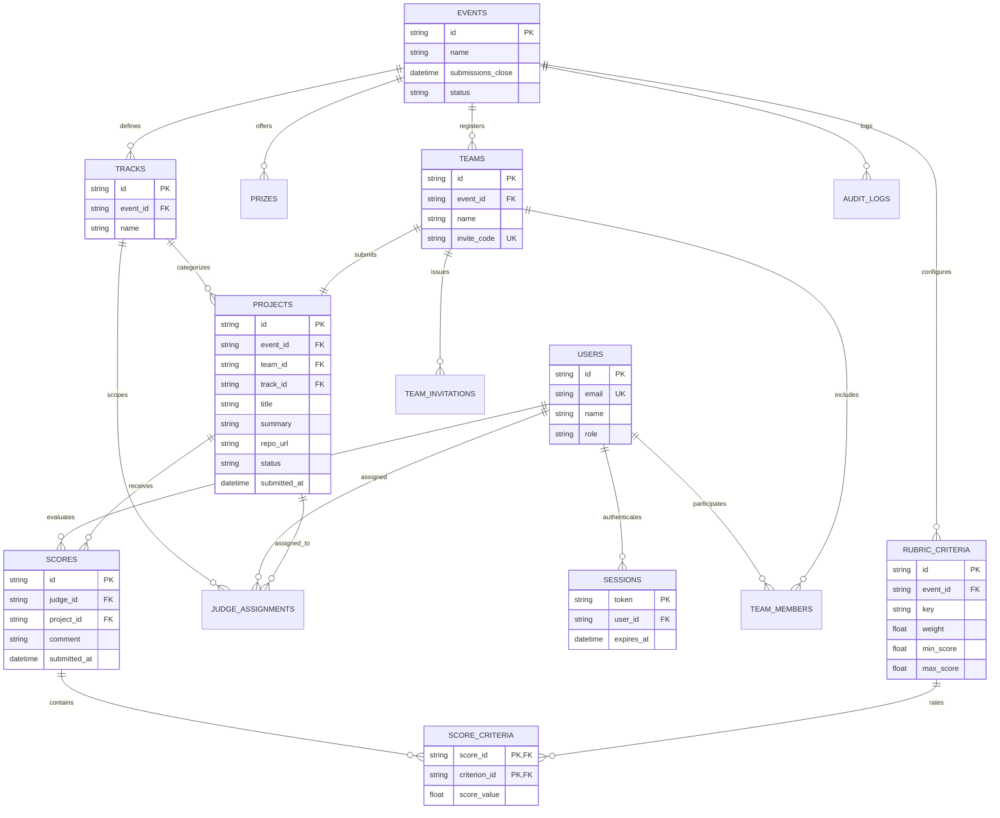

# Verity: Data Model and Schema Specification

> **Event Context**: DOGFOOD 2026 Hackathon  
> **Challenge**: "Build the platform that will judge you."  
> **Repository**: [`techoprohit/Verity`](https://github.com/techoprohit/Verity)  
> **Document Status**: Canonical Data Model and Database Schema Specification

---

## 1. Data-Model Overview

The Verity data model provides a normalized relational schema designed for self-hosted hackathon operations. It cleanly decouples external input formats (such as [`fixtures.json`](https://dogfoodhack.com/spec/fixtures.json)) from internal business logic, guaranteeing ACID transactional integrity, strict role-based access control, weighted rubric scoring, and defensible score normalization.

### Implementation Status Notice
- **Current Repository State**: The repository is in the kickoff/architecture phase ([`SPEC.md`](file:///d:/Code/DogFood/Verity/SPEC.md), [`README.md`](file:///d:/Code/DogFood/Verity/README.md), [`ARCHITECTURE.md`](file:///d:/Code/DogFood/Verity/ARCHITECTURE.md)). No physical SQL DDL or migration scripts have been committed to `src/` yet.
- **Specification Purpose**: This document establishes the **canonical relational schema**, table structures, constraints, and import/export mappings for Verity's implementation.

### Key Architectural Tenets of the Data Model:
1. **Relational Normalization over Document Blobs**: While `fixtures.json` stores arrays of emails, track IDs, and unweighted criterion dictionaries, Verity decomposes these into normalized relational entities with explicit foreign keys.
2. **First-Class Judging & Rubrics**: Rubric criteria carry explicit organizer-configured weights ($w_i$), preventing flat, unweighted judging.
3. **Auditability**: Score submissions, modifications, and administrative state changes are recorded in an append-only audit ledger.
4. **Resilient to Awkward Data**: Handles missing reviews, unequal reviewer batch sizes, zero-variance judges, and duplicate submissions without schema violation.

---

## 2. Entity List

The schema is composed of the following core entities:

```
+-----------------------------------------------------------------------------------+
|                                CORE RELATIONAL TABLES                             |
+-------------------+--------------------+--------------------+---------------------+
| events            | tracks             | prizes             | users               |
| sessions          | teams              | team_members       | team_invitations    |
| projects          | rubric_criteria    | judge_assignments  | scores              |
| score_criteria    | audit_logs         | community_votes    |                     |
+-------------------+--------------------+--------------------+---------------------+
```

---

### 1. `events`
Represents hackathon instances managed by the platform.
- **Purpose**: Defines event boundaries, dates, and hard submission deadlines.
- **Primary Key**: `id` (`VARCHAR(64)`)
- **Important Fields**:
  - `id`: Unique event identifier (e.g., `'evt_01'`).
  - `name`: Display name of the event (e.g., `'Sample Hack 2026'`).
  - `submissions_close`: UTC ISO 8601 timestamp after which submissions are strictly locked.
  - `status`: Lifecycle phase (`'draft'`, `'open'`, `'closed'`, `'judging'`, `'published'`, `'archived'`).
  - `created_at`: Creation timestamp (UTC).
- **Foreign Keys**: None.
- **Nullable Fields**: None.
- **Constraints**: `submissions_close` must be a valid UTC timestamp.

---

### 2. `tracks`
Thematic categories within an event.
- **Purpose**: Classifies projects and partitions judge evaluation batches.
- **Primary Key**: `id` (`VARCHAR(64)`)
- **Important Fields**:
  - `id`: Unique track identifier (e.g., `'trk_01'`).
  - `event_id`: Target event reference.
  - `name`: Track name (e.g., `'Developer tools'`).
  - `description`: Optional track description.
- **Foreign Keys**: `event_id` $\rightarrow$ `events(id)` ON DELETE CASCADE.
- **Nullable Fields**: `description`.
- **Constraints**: `UNIQUE(event_id, name)`.

---

### 3. `prizes`
Awards configured by the organizer for specific tracks or overall excellence.
- **Purpose**: Defines award categories and monetary or credential amounts.
- **Primary Key**: `id` (`VARCHAR(64)`)
- **Important Fields**:
  - `id`: Unique prize identifier.
  - `event_id`: Reference to event.
  - `track_id`: Optional track-specific prize reference.
  - `name`: Prize title (e.g., `'Grand Prize'`, `'Best Developer Tool'`).
  - `amount`: Dollar value or description.
- **Foreign Keys**:
  - `event_id` $\rightarrow$ `events(id)` ON DELETE CASCADE
  - `track_id` $\rightarrow$ `tracks(id)` ON DELETE SET NULL
- **Nullable Fields**: `track_id`.

---

### 4. `users`
Unified identity entity for all platform actors.
- **Purpose**: Represents organizers, participants, judges, and administrators.
- **Primary Key**: `id` (`VARCHAR(64)`)
- **Important Fields**:
  - `id`: Unique user identifier (e.g., `'usr_01'`, `'jdg_01'`).
  - `email`: Normalized lowercase email address.
  - `name`: Full display name.
  - `role`: Role string (`'visitor'`, `'participant'`, `'judge'`, `'organizer'`, `'admin'`).
  - `created_at`: UTC timestamp.
- **Foreign Keys**: None.
- **Nullable Fields**: None.
- **Constraints**: `UNIQUE(email)`.

---

### 5. `sessions`
Authentication sessions linking tokens to platform users.
- **Purpose**: Enables deterministic test sessions (`.dogfood.toml`) and active browser cookies.
- **Primary Key**: `token` (`VARCHAR(128)`)
- **Important Fields**:
  - `token`: Session key (e.g., `'org_7f2a'`, `'jdg_a_91bc'`, `'jdg_b_44de'`, `'prt_2e88'`).
  - `user_id`: Target user reference.
  - `expires_at`: UTC expiration timestamp (or NULL for static test sessions).
  - `created_at`: UTC creation timestamp.
- **Foreign Keys**: `user_id` $\rightarrow$ `users(id)` ON DELETE CASCADE.
- **Nullable Fields**: `expires_at`.
- **Constraints**: `UNIQUE(token)`.

---

### 6. `teams`
Participant collaborator groups.
- **Purpose**: Groups hackers submitting a single project entry.
- **Primary Key**: `id` (`VARCHAR(64)`)
- **Important Fields**:
  - `id`: Unique team identifier (e.g., `'tm_01'`).
  - `event_id`: Target event reference.
  - `name`: Team name (e.g., `'Nightshift'`).
  - `invite_code`: Random unique token for joining via link.
  - `created_at`: UTC creation timestamp.
- **Foreign Keys**: `event_id` $\rightarrow$ `events(id)` ON DELETE CASCADE.
- **Nullable Fields**: None.
- **Constraints**: `UNIQUE(event_id, name)`, `UNIQUE(invite_code)`.

---

### 7. `team_members`
Association table connecting users to teams.
- **Purpose**: Defines team rosters and participant authorization.
- **Primary Key**: Composite `(team_id, user_id)`
- **Important Fields**:
  - `team_id`: Reference to team.
  - `user_id`: Reference to user.
  - `is_lead`: Boolean flag denoting team creator/lead.
  - `joined_at`: UTC timestamp.
- **Foreign Keys**:
  - `team_id` $\rightarrow$ `teams(id)` ON DELETE CASCADE
  - `user_id` $\rightarrow$ `users(id)` ON DELETE CASCADE
- **Nullable Fields**: None.
- **Constraints**: A user can only belong to one team per event.

---

### 8. `team_invitations`
Pending invitations to join a team.
- **Purpose**: Manages email invites and shareable links for team formation.
- **Primary Key**: `id` (`VARCHAR(64)`)
- **Important Fields**:
  - `id`: Unique invitation identifier.
  - `team_id`: Reference to team.
  - `invite_email`: Target email.
  - `status`: `'pending'`, `'accepted'`, `'revoked'`.
  - `created_at`: UTC creation timestamp.
- **Foreign Keys**: `team_id` $\rightarrow$ `teams(id)` ON DELETE CASCADE.
- **Nullable Fields**: None.

---

### 9. `projects`
Hackathon submission entries.
- **Purpose**: Holds project metadata, demo URLs, and tracks submission status.
- **Primary Key**: `id` (`VARCHAR(64)`)
- **Important Fields**:
  - `id`: Unique project identifier (e.g., `'prj_01'`).
  - `event_id`: Reference to event.
  - `team_id`: Submitting team.
  - `track_id`: Selected competition track.
  - `title`: Project title (e.g., `'Quiet Hours'`).
  - `summary`: Short pitch or tagline.
  - `repo_url`: Public source repository link.
  - `demo_url`: Optional live demo or video link.
  - `status`: Lifecycle state (`'draft'`, `'submitted'`, `'locked'`).
  - `submitted_at`: Timestamp when first marked submitted or imported.
  - `updated_at`: Timestamp of latest modification.
- **Foreign Keys**:
  - `event_id` $\rightarrow$ `events(id)` ON DELETE CASCADE
  - `team_id` $\rightarrow$ `teams(id)` ON DELETE CASCADE
  - `track_id` $\rightarrow$ `tracks(id)` ON DELETE RESTRICT
- **Nullable Fields**: `demo_url`, `submitted_at`.
- **Constraints**: `UNIQUE(event_id, team_id)` — exactly one submission per team.

---

### 10. `rubric_criteria`
Scoring criteria configured by the organizer.
- **Purpose**: Defines rubric items with specific non-flat weights ($w_i$).
- **Primary Key**: `id` (`VARCHAR(64)`)
- **Important Fields**:
  - `id`: Unique criterion identifier (e.g., `'crt_func'`, `'crt_qual'`).
  - `event_id`: Reference to event.
  - `key`: Slug matching score payloads (e.g., `'functionality'`, `'quality'`).
  - `label`: Human-readable title (e.g., `'Functionality & Completeness'`).
  - `weight`: Positive numerical multiplier $w_i > 0$ (e.g., `0.40` for 40%).
  - `min_score`: Minimum score allowed (default `1.0`).
  - `max_score`: Maximum score allowed (default `5.0`).
- **Foreign Keys**: `event_id` $\rightarrow$ `events(id)` ON DELETE CASCADE.
- **Nullable Fields**: None.
- **Constraints**: `UNIQUE(event_id, key)`, `CHECK(weight > 0)`, `CHECK(min_score < max_score)`.

---

### 11. `judge_assignments`
Assignments mapping judges to tracks or specific projects.
- **Purpose**: Controls the judge's evaluation queue and enforces access boundaries.
- **Primary Key**: `id` (`VARCHAR(64)`)
- **Important Fields**:
  - `id`: Unique assignment identifier.
  - `judge_id`: Reference to user with role `judge`.
  - `event_id`: Reference to event.
  - `track_id`: Optional track-wide assignment.
  - `project_id`: Optional specific project assignment.
- **Foreign Keys**:
  - `judge_id` $\rightarrow$ `users(id)` ON DELETE CASCADE
  - `event_id` $\rightarrow$ `events(id)` ON DELETE CASCADE
  - `track_id` $\rightarrow$ `tracks(id)` ON DELETE CASCADE
  - `project_id` $\rightarrow$ `projects(id)` ON DELETE CASCADE
- **Nullable Fields**: `track_id`, `project_id` (at least one must be non-null).
- **Constraints**: `UNIQUE(judge_id, project_id)`.

---

### 12. `scores`
Header record for a judge's evaluation of a project.
- **Purpose**: Associates a judge, a project, qualitative comments, and review timestamps.
- **Primary Key**: `id` (`VARCHAR(64)`)
- **Important Fields**:
  - `id`: Unique score record identifier.
  - `judge_id`: Reference to evaluating judge.
  - `project_id`: Reference to evaluated project.
  - `comment`: Qualitative feedback (may be empty string).
  - `submitted_at`: Immutable UTC evaluation timestamp.
  - `updated_at`: Timestamp of score update.
- **Foreign Keys**:
  - `judge_id` $\rightarrow$ `users(id)` ON DELETE RESTRICT
  - `project_id` $\rightarrow$ `projects(id)` ON DELETE CASCADE
- **Nullable Fields**: `comment` (or empty string `""`).
- **Constraints**: `UNIQUE(judge_id, project_id)` — a judge submits exactly one review scorecard per project.

---

### 13. `score_criteria`
Detailed numerical ratings per rubric criterion within a scorecard.
- **Purpose**: Stores individual criterion scores supporting the multi-criteria rubric.
- **Primary Key**: Composite `(score_id, criterion_id)`
- **Important Fields**:
  - `score_id`: Reference to parent review `scores(id)`.
  - `criterion_id`: Reference to `rubric_criteria(id)`.
  - `score_value`: Floating point or integer rating $s_i \in [1, 5]$.
- **Foreign Keys**:
  - `score_id` $\rightarrow$ `scores(id)` ON DELETE CASCADE
  - `criterion_id` $\rightarrow$ `rubric_criteria(id)` ON DELETE RESTRICT
- **Nullable Fields**: None.
- **Constraints**: `CHECK(score_value >= 1.0 AND score_value <= 5.0)`.

---

### 14. `audit_logs`
Immutable record of security and administrative operations.
- **Purpose**: Audit trail for score submissions, score modifications, and unauthorized attempts.
- **Primary Key**: `id` (`VARCHAR(64)`)
- **Important Fields**:
  - `id`: Unique log entry identifier.
  - `actor_id`: User ID initiating the operation.
  - `action`: Operation code (`'SCORE_CREATE'`, `'SCORE_UPDATE'`, `'UNAUTHORIZED_PEER_PROBE'`, `'STATUS_CHANGE'`).
  - `entity_type`: Target table name (`'scores'`, `'projects'`, `'events'`).
  - `entity_id`: Target primary key.
  - `payload_diff`: JSON object storing previous and new attribute values.
  - `ip_address`: Client remote IP address.
  - `created_at`: UTC timestamp.
- **Foreign Keys**: `actor_id` $\rightarrow$ `users(id)` ON DELETE SET NULL.
- **Nullable Fields**: `actor_id`, `payload_diff`, `ip_address`.

---

### 15. `community_votes` (T3 Stretch Concept)
Ballots cast by public or authenticated participants for community awards.
- **Purpose**: Stores public choice votes with anti-abuse audit metadata.
- **Primary Key**: `id` (`VARCHAR(64)`)
- **Important Fields**:
  - `id`: Unique ballot identifier.
  - `event_id`: Reference to event.
  - `voter_email`: Verified email or session identifier.
  - `project_id`: Target project choice.
  - `created_at`: UTC ballot submission timestamp.
- **Foreign Keys**:
  - `event_id` $\rightarrow$ `events(id)` ON DELETE CASCADE
  - `project_id` $\rightarrow$ `projects(id)` ON DELETE CASCADE
- **Nullable Fields**: None.
- **Constraints**: `UNIQUE(event_id, voter_email)`.

---

## 3. Relationships

The relational links between entities reflect hackathon operations:

- **`events` $\rightarrow$ `tracks` (1 to Many)**:
  An event contains multiple competitive tracks (e.g. Developer Tools, AI).
- **`events` $\rightarrow$ `teams` (1 to Many)**:
  Teams are scoped to an event.
- **`teams` $\rightarrow$ `team_members` (1 to Many) $\rightarrow$ `users` (Many to 1)**:
  A team has one to four members. A user belongs to one team per event.
- **`teams` $\rightarrow$ `projects` (1 to 1)**:
  A team produces exactly one project per event.
- **`tracks` $\rightarrow$ `projects` (1 to Many)**:
  Each project registers under exactly one track.
- **`users` (Judges) $\rightarrow$ `judge_assignments` (1 to Many)**:
  A judge is assigned multiple tracks or specific projects.
- **`judge_assignments` $\rightarrow$ `projects` (Many to 1)**:
  Direct or track-derived project evaluation assignments.
- **`projects` $\rightarrow$ `scores` (1 to Many)**:
  A project receives multiple reviews from distinct assigned judges.
- **`scores` $\rightarrow$ `score_criteria` (1 to Many) $\leftarrow$ `rubric_criteria` (Many to 1)**:
  Each score breaks down into rated criteria defined by the event rubric.

---

## 4. Entity-Relationship (ER) Diagram



---

## 5. Constraints and Invariants

| Invariant / Constraint Rule | Enforcement Level | Defense Rationale |
| :--- | :--- | :--- |
| **Unique IDs** | Primary Key Constraints (`id`) | Guarantees entity identity across the relational graph. |
| **Single Submission per Team** | `UNIQUE(event_id, team_id)` on `projects` | Prevents duplicate project entries from the same team. |
| **One Review per Judge per Project** | `UNIQUE(judge_id, project_id)` on `scores` | Prevents a judge from submitting duplicate scorecards for the same project. |
| **Positive Rubric Weights** | `CHECK(weight > 0)` on `rubric_criteria` | Prevents division by zero in weighted average calculations: $\sum w_i > 0$. |
| **Bounded Score Values** | `CHECK(score_value >= 1.0 AND score_value <= 5.0)` | Prevents invalid score values from corrupting normalization calculations. |
| **Strict Submission Deadline** | Controller validation checking `event.submissions_close` | Rejects late submissions with HTTP 4xx errors. |
| **Peer Score Isolation** | Authorization guard: `caller.id == score.judge_id OR caller.role == 'organizer'` | Rejects unauthorized queries with HTTP 403 Forbidden. |
| **Valid Role Enumeration** | `CHECK(role IN ('visitor', 'participant', 'judge', 'organizer', 'admin'))` | Enforces the 5 DOGFOOD roles at the database layer. |

---

## 6. Judging Data Model & Calculation Pipeline

### Representation of Assignments
Judges are mapped to projects via `judge_assignments`:
- Track-level assignment: `track_id` is set; the judge evaluates all projects in that track.
- Project-level assignment: `project_id` is set; the judge evaluates a specific project.

### Representation of Criteria and Weights
The organizer configures criteria in `rubric_criteria`. For example:
- `key = 'functionality'`, `weight = 0.40` (40%)
- `key = 'quality'`, `weight = 0.30` (30%)
- `key = 'originality'`, `weight = 0.30` (30%)

### Score Storage
Scores are split into header and items:
- `scores`: Captures `judge_id`, `project_id`, `comment`, and `submitted_at`.
- `score_criteria`: Captures `score_id`, `criterion_id`, and `score_value`.

### Calculation Pipeline (Raw to Normalized)
1. **Raw Weighted Sum per Review ($S_{p, j}$)**:
   For project $p$ and judge $j$:
   $$S_{p, j} = \frac{\sum_{i} (w_i \cdot s_{i, p, j})}{\sum_i w_i}$$

2. **Judge Calibration Statistics**:
   Compute sample mean $\mu_j$ and sample standard deviation $\sigma_j$ for each judge $j$ across all their reviews:
   $$\mu_j = \frac{1}{N_j} \sum_{p=1}^{N_j} S_{p, j}, \quad \sigma_j = \sqrt{\frac{1}{N_j} \sum_{p=1}^{N_j} (S_{p, j} - \mu_j)^2}$$

3. **Standardized Z-Score**:
   If $\sigma_j > 0$:
   $$z_{p, j} = \frac{S_{p, j} - \mu_j}{\sigma_j}$$
   If $\sigma_j = 0$ (judge gave identical scores to every project):
   $$z_{p, j} = 0.0$$

4. **Global Rescaling (0–100 scale)**:
   $$S_{norm}(p, j) = \mu_{global} + (z_{p, j} \cdot \sigma_{global})$$

5. **Final Project Score**:
   $$\text{FinalScore}(p) = \frac{1}{M_p} \sum_{j=1}^{M_p} S_{norm}(p, j)$$
   *(where $M_p$ is the number of reviews submitted for project $p$)*.

### Handling Incomplete Reviews
If a project receives 2 reviews while another receives 5 reviews, the final score is the average of the available normalized reviews. Unassigned reviews do not count as zero.

---

## 7. Audit Model

The `audit_logs` table provides an immutable record of sensitive operations:

```sql
CREATE TABLE audit_logs (
    id VARCHAR(64) PRIMARY KEY,
    actor_id VARCHAR(64),
    action VARCHAR(64) NOT NULL,
    entity_type VARCHAR(64) NOT NULL,
    entity_id VARCHAR(64) NOT NULL,
    payload_diff TEXT,
    ip_address VARCHAR(45),
    created_at TIMESTAMP NOT NULL DEFAULT CURRENT_TIMESTAMP,
    FOREIGN KEY (actor_id) REFERENCES users(id) ON DELETE SET NULL
);
```

### Audited Actions:
- `SCORE_CREATE`: Recorded when a judge submits a new review scorecard.
- `SCORE_UPDATE`: Recorded when a judge modifies an existing scorecard.
- `PEER_SCORE_PROBE`: Recorded when a judge attempts to access another judge's scorecard.
- `SUBMISSION_LOCK`: Recorded when the submission cutoff passes and projects transition to `locked`.
- `EXPORT_GENERATED`: Recorded when an organizer downloads `export.csv`.

---

## 8. Fixture Import Pipeline

`fixtures.json` is input data that is ingested and normalized into Verity's relational schema:

```
fixtures.json (Input JSON)
  │
  ├── event              ──>  INSERT INTO events
  ├── tracks             ──>  INSERT INTO tracks
  ├── judges             ──>  INSERT INTO users (role='judge')
  │                           INSERT INTO judge_assignments (track_id)
  ├── teams              ──>  INSERT INTO teams
  │                           INSERT INTO users (role='participant')
  │                           INSERT INTO team_members
  ├── projects           ──>  INSERT INTO projects
  └── scores             ──>  INSERT INTO scores
                              INSERT INTO score_criteria
```

### Transformation Example

#### 1. Judge Ingestion
**In `fixtures.json`**:
```json
{
  "id": "jdg_01",
  "name": "Ada Okonkwo",
  "email": "ada@example.org",
  "tracks": ["trk_01"]
}
```
**Transformed Relational Entities**:
```sql
-- 1. Insert User
INSERT INTO users (id, name, email, role)
VALUES ('jdg_01', 'Ada Okonkwo', 'ada@example.org', 'judge');

-- 2. Insert Track Assignment
INSERT INTO judge_assignments (id, judge_id, event_id, track_id)
VALUES ('asgn_jdg_01_trk_01', 'jdg_01', 'evt_01', 'trk_01');
```

#### 2. Score Ingestion
**In `fixtures.json`**:
```json
{
  "judge": "jdg_01",
  "project": "prj_01",
  "criteria": { "functionality": 4, "quality": 3 },
  "comment": "Solid architecture."
}
```
**Transformed Relational Entities**:
```sql
-- 1. Insert Score Header
INSERT INTO scores (id, judge_id, project_id, comment, submitted_at)
VALUES ('scr_01', 'jdg_01', 'prj_01', 'Solid architecture.', CURRENT_TIMESTAMP);

-- 2. Insert Criteria Items
INSERT INTO score_criteria (score_id, criterion_id, score_value)
VALUES ('scr_01', 'crt_func', 4.0),
       ('scr_01', 'crt_qual', 3.0);
```

---

## 9. Handling Incomplete & Awkward Fixture Data

The DOGFOOD fixture data includes deliberate edge cases:

| Awkward Fixture Case | Schema & Ingestion Defense |
| :--- | :--- |
| **Missing Score Entries** | Sparse reviews are expected. The schema avoids mandatory minimum review constraints. The calculation engine normalizes available reviews without treating missing scores as zero. |
| **Uniform-Scoring Judge ($\sigma_j = 0$)** | A fixture judge gives identical scores to all projects. Division by zero in standard deviation calculation is intercepted; the judge's Z-score delta defaults to $0.0$. |
| **Incomplete Review Batches** | Judges who leave batches partially finished do not invalidate existing reviews. All completed reviews remain valid and normalized. |
| **Duplicate Submissions** | The schema enforces `UNIQUE(event_id, team_id)`. Re-submitting updates the existing draft rather than creating duplicate project records. |
| **Empty or Missing Comments** | The `comment` field allows empty strings (`""`) without throwing null-constraint violations. |

---

## 10. Export Model (`export.csv`)

The export pipeline generates RFC 4180-compliant CSV data for organizers over `GET /api/export.csv`:

```
+----------------------------------------------------------------------------------------------------+
|                                      CSV EXPORT OUTPUT FORMAT                                      |
+----------------------------------------------------------------------------------------------------+
| project_id,title,team_name,track,review_count,raw_average,normalized_score,status                  |
| prj_01,"Quiet Hours","Nightshift","Developer tools",3,3.67,78.4,completed                          |
| prj_02,"CodeFlow","DevRaptors","Developer tools",2,4.10,82.1,completed                            |
+----------------------------------------------------------------------------------------------------+
```

### Relational Mapping:
- `project_id`: `projects.id`
- `title`: `projects.title`
- `team_name`: `teams.name` (via `projects.team_id`)
- `track`: `tracks.name` (via `projects.track_id`)
- `review_count`: `COUNT(scores.id)`
- `raw_average`: Mean of weighted review scores $\frac{1}{M} \sum S_{p, j}$
- `normalized_score`: Output of the Z-score normalization engine
- `status`: `projects.status`

---

## 11. Data Integrity and Validation

1. **Foreign Key Enforcement**:
   SQLite PRAGMA `foreign_keys = ON;` is enforced on every database connection, guaranteeing referential integrity across cascades.
2. **ACID Transactions**:
   Multi-table writes (such as saving a scorecard and its criterion items, or ingesting fixtures) execute inside explicit transactions (`BEGIN IMMEDIATE ... COMMIT`).
3. **Application-Level Validation**:
   - URL validation on `repo_url` and `demo_url`.
   - UTF-8 string sanitization and character length constraints on titles and summaries.
   - Timestamp validation against the UTC system clock.

---

## 12. Migration Strategy

To support reproducible offline deployments:
1. **Numbered SQL Migrations**:
   Schema evolution is managed via sequential SQL files:
   - `001_initial_schema.sql`
   - `002_rubric_weights.sql`
   - `003_audit_trail.sql`
2. **Schema Version Tracking**:
   A lightweight tracking table records applied migrations:
   ```sql
   CREATE TABLE schema_migrations (
       version INTEGER PRIMARY KEY,
       applied_at TIMESTAMP DEFAULT CURRENT_TIMESTAMP
   );
   ```
3. **Automatic Boot Migration**:
   On container startup, the application inspects `schema_migrations` and applies pending migrations before starting the HTTP listener.

---

## 13. Design Rationale

| Design Decision | Justification for DOGFOOD 2026 |
| :--- | :--- |
| **Relational Model over Document Store** | Hackathon data is fundamentally relational: events have tracks, teams have members, projects receive scores from judges. Relational schemas provide ACID guarantees for judging integrity. |
| **Separating Score Header from Criteria Items** | Supports dynamic, organizer-configured rubrics without altering table columns when criteria are added or weights are adjusted. |
| **Explicit Weights on Criteria** | Fulfills the DOGFOOD requirement for weighted judging rubrics, overcoming the limitation of flat scoring platforms. |
| **Embedded SQLite Database** | Satisfies the offline **One Command Rule** with zero network database dependencies, zero port conflicts, and instant startup. |

---

## 14. Known Limitations

1. **Current Codebase State**:
   - The repository currently contains data model specifications and documentation. The DDL scripts and migration runner are in active development.
2. **Concurrency Scaling**:
   - SQLite handles concurrent reads efficiently via WAL mode, but serializes writes. This is well within hackathon load requirements (<50 writes/second), but would require migration to PostgreSQL for large-scale enterprise deployments (>10,000 participants).
3. **Static Historical Fixture Dates**:
   - The DOGFOOD fixture data includes a static event with a cutoff in March 2026. Because deadline checks rely on the real system clock, this event remains permanently closed for testing late-submission rejection. Testing active submissions requires creating a new event record with a future cutoff date.
