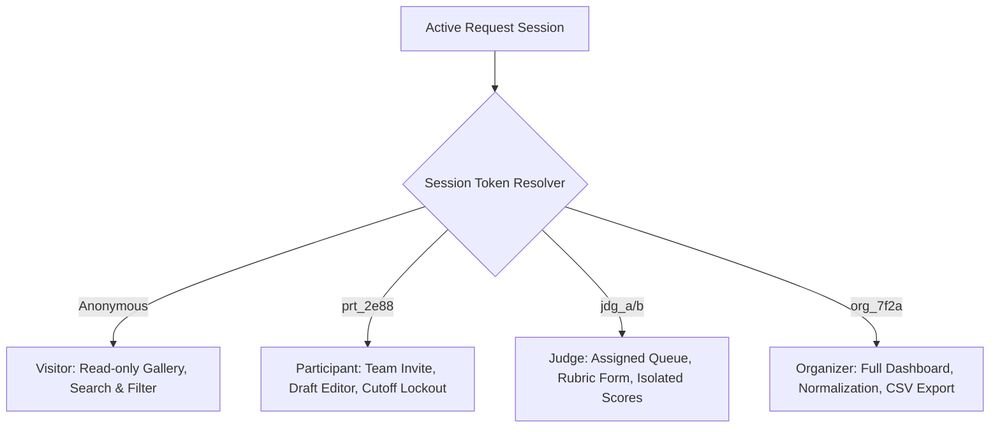

# Verity: Comprehensive Design Specification and Visual Identity System

> **Event Context**: DOGFOOD 2026 Hackathon  
> **Tagline**: "Build the platform that will judge you."  
> **Repository**: [`techoprohit/Verity`](https://github.com/techoprohit/Verity)  
> **Visual Reference**: [https://dogfoodhack.com/](https://dogfoodhack.com/)  
> **Document Status**: Complete Implementation-Ready Design Specification

---

## 01. Design Overview

### Purpose of the Design System
This document establishes the canonical visual identity, design tokens, component anatomy, layout hierarchy, and interaction mechanics for **Verity**. Verity is an open-source, self-hostable hackathon submission and judging platform engineered under the DOGFOOD 2026 challenge. The design system translates the rigorous mathematical and security requirements of [`SPEC.md`](file:///d:/Code/DogFood/Verity/SPEC.md) into an authoritative, dense, and technically transparent user interface.

### Product Visual Direction: Technical Industrialism & Editorial Restraint
Verity avoids generic corporate SaaS tropes—there are no pastel blob gradients, oversized cartoonish corner radii, or artificial whitespace padding. Instead, the interface adopts a **Technical Industrial Aesthetic** directly inspired by the official DOGFOOD visual language:
- **Atmospheric Palette**: Deep obsidian and navy base surfaces (`#0B1020`, `#0E1428`) punctuated by laser-sharp neon cyan (`#00E5D0`) and hot magenta/coral (`#FF3D6E`) accents.
- **Architectural Framing**: Crisp 1px hairline borders (`#1B2540`, `#26355C`) defining strict data cells and modular panels.
- **Typographic Rigor**: High-contrast geometric grotesque headings paired with uncompromising monospace data grids and terminal-inspired bracketed metadata (`[ STATUS / LOCKED ]`).
- **Functional Density**: Prioritizing information legibility and rapid keyboard/mouse evaluation for judges reviewing dozens of projects and organizers managing high-stakes live deliberations.

### Relationship Between Design Decisions and DOGFOOD Requirements
Every visual choice reinforces core DOGFOOD platform mandates:
1. **The Backend Security Rule**: Visual access states (e.g., hidden scorecards, locked submission inputs) strictly reflect backend authority. Forbidden routes render austere, explicit terminal security warnings rather than ambiguous blank screens.
2. **Judging Integrity**: Weighted rubrics and normalized standing calculations are displayed with absolute clarity, highlighting criterion weight multipliers ($w_i$), raw scores, and calibrated Z-scores side-by-side.
3. **The 100% Offline Rule**: The design system relies exclusively on self-hostable, localizable fonts and CSS primitives, requiring zero third-party CDNs, external webfont requests, or hosted icon libraries.

---

## 02. Product and Interface Scope

### Documented User Roles (from `SPEC.md`)
The interface strictly supports the five documented roles without addition:
1. `visitor`: Unauthenticated public explorer. Discovers projects, browses tracks, searches entries.
2. `participant`: Authenticated team hacker. Manages team membership via invite link, drafts project submission, edits fields until deadline.
3. `judge`: Authenticated evaluator. Reviews assigned project queues, evaluates multi-criteria rubrics, enters qualitative feedback, reviews personal scorecards.
4. `organizer`: Hackathon administrator. Configures dates/tracks/prizes, balances judge assignments, monitors live progress dashboard, reviews normalized scores, downloads CSV exports.
5. `admin`: System-level administrator. Direct event and database management.

### Documented Product Areas and Workflows
```
+----------------------------------------------------------------------------------------------------+
|                                    VERITY PRODUCT INTERFACE MAP                                    |
+--------------------------+--------------------------+-----------------------+----------------------+
| 1. Public Gallery        | 2. Participant Portal    | 3. Judging Portal     | 4. Organizer Console |
| Route: /projects         | Route: /projects/new     | Route: /judge         | Route: /admin        |
| - Unauthenticated search | - Team invite join       | - Assigned queue      | - Event settings     |
| - Track filtering        | - Submission draft/edit  | - Weighted rubric form| - Progress dashboard |
| - Project showcase modal | - Cutoff timer / lockout | - Isolated scorecards | - Normalization view |
| - Fixture project cards  | - Submission receipt     | - Progress tracker    | - CSV export trigger |
+--------------------------+--------------------------+-----------------------+----------------------+
```

### Implementation vs. Specification Status
- **Repository Implementation Status**: The repository is currently at the kickoff/architecture phase ([`SPEC.md`](file:///d:/Code/DogFood/Verity/SPEC.md), [`README.md`](file:///d:/Code/DogFood/Verity/README.md), [`ARCHITECTURE.md`](file:///d:/Code/DogFood/Verity/ARCHITECTURE.md), [`DATA-MODEL.md`](file:///d:/Code/DogFood/Verity/DATA-MODEL.md), [`JUDGING.md`](file:///d:/Code/DogFood/Verity/JUDGING.md), [`SECURITY.md`](file:///d:/Code/DogFood/Verity/SECURITY.md)).
- **Existing Screens in Repo**: None implemented in physical frontend code yet (*Specified but unimplemented*).
- **Design Proposal Scope**: This document specifies the complete layout and component system required to implement all T1 through T4 interfaces required by `SPEC.md`.

---

## 03. Design Principles

1. **Clarity Over Decoration**  
   Every element on screen must convey state, data, or actionable workflow. Purely decorative elements that impede data scanning or evaluation speed are rejected.
2. **Backend Authority Transparency**  
   The UI never masks or synthesizes state. If an event is closed, the UI communicates the server timestamp cutoff clearly. If a peer score is probed, the UI surfaces the authoritative HTTP 403 response.
3. **High-Density Utility**  
   Hackathon organizers and judges evaluate high volumes of dense data under tight deadlines. Tables, rubric matrices, and project queues prioritize tight vertical rhythm and scannable tabular alignment.
4. **Terminal Precision and Industrial Polish**  
   Drawing from `dogfoodhack.com`, borders, labels, and metadata use monospace bracketed tags (`[ TRACK / DEV-TOOLS ]`), crisp geometric lines, and deliberate contrast to evoke an industrial computing terminal.
5. **Universal Offline Usability**  
   Every font, icon, style, and component must render flawlessly on a laptop operating completely disconnected from the internet.
6. **Zero-Ambiguity Feedback**  
   Form validation, score calculation, deadline countdowns, and network transactions provide immediate, high-contrast visual feedback with distinct error and confirmation styling.

---

## 04. Brand and Visual Identity

### Visual Personality: The "Verity Terminal"
Verity’s visual identity communicates impartiality, structural precision, and transparency. It treats the hackathon platform not as a promotional marketing page, but as a high-precision judging instrument.

### Visual Motifs & Art Direction:
- **Structural Gridlines**: Section boundaries are anchored with `1px solid #1B2540` hairline dividers and subtle accent borders (`#00E5D0`, `#FF3D6E`).
- **Bracketed Monospace Tags**: System states, role badges, and track metadata are encased in bracketed typographic enclosures: `[ ROLE: JUDGE ]`, `[ STATUS: LOCKED ]`.
- **Status Indicators**: Monospace blinking or pulsing hardware-style dots indicating live status (`● SYS READY`, `● CLOSED`).
- **Subtle Scanline/Grid Atmosphere**: Background surfaces feature optional ultra-low opacity CSS linear-gradient grid lines ($120\text{px} \times 120\text{px}$ pitch) to reinforce the blueprint feel.

### Logo & Wordmark Treatment
- **Wordmark**: `VERITY` rendered in bold, geometric uppercase sans-serif with wide tracking:
  ```
  VERITY // [DOGFOOD-2026]
  ```
- **Mark**: An abstract geometric caliper/scales glyph composed of pure CSS/SVG hairline vectors, symbolizing mathematical scoring calibration and balance.

---

## 05. Color System

The color palette is built on deep dark-mode contrast with curated semantic accents derived from the visual reference.

### Color Tokens Table

| Token Name | HEX Value | CSS Variable | Intended Usage & Contrast Notes |
| :--- | :--- | :--- | :--- |
| **Brand Primary (Cyan)** | `#00E5D0` | `--color-brand-cyan` | Interactive highlights, active tabs, primary outlines, brand accent (11.8:1 contrast on `#0B1020`) |
| **Brand Secondary (Pink)**| `#FF3D6E` | `--color-brand-pink` | Primary call-to-action buttons, deadline alerts, critical badges (6.2:1 contrast on `#0B1020`) |
| **Background (Void)** | `#0B1020` | `--color-bg-void` | Root application background, page canvas |
| **Surface Level 1** | `#0E1428` | `--color-surface-base` | Primary cards, table bodies, form field backgrounds |
| **Surface Level 2** | `#131C36` | `--color-surface-raised`| Navigation headers, modal dialogs, elevated drawers |
| **Surface Level 3** | `#16203A` | `--color-surface-hover` | Table row hover, input focus backgrounds |
| **Border Subtle** | `#16203A` | `--color-border-subtle` | Subtle card dividers, nested cell borders |
| **Border Default** | `#1B2540` | `--color-border-default`| Standard card borders, table outlines, button borders |
| **Border Strong** | `#26355C` | `--color-border-strong` | Active container borders, hover card outlines |
| **Border Accent** | `#00E5D0` | `--color-border-accent` | Focused inputs, selected items, header demarcation |
| **Text Primary** | `#E6ECFF` | `--color-text-primary` | Main titles, table cells, form values (13.4:1 contrast on `#0B1020`) |
| **Text Secondary** | `#AEBAD6` | `--color-text-secondary`| Descriptions, body copy, rubric prompts (8.5:1 contrast on `#0B1020`) |
| **Text Muted** | `#6B7A9E` | `--color-text-muted` | Field labels, metadata tags, breadcrumbs (4.8:1 contrast on `#0B1020`) |
| **Text Dim** | `#4A5A80` | `--color-text-dim` | Disabled text, decorative line markings |
| **Semantic Success** | `#00E5A3` | `--color-success` | Submitted status, pass indicators in acceptance reports |
| **Semantic Warning** | `#FFB800` | `--color-warning` | Looming deadlines, draft status, incomplete review batches |
| **Semantic Error** | `#FF334B` | `--color-error` | Validation errors, late submission rejection, HTTP 403 Forbidden |
| **Semantic Info** | `#3D8BFF` | `--color-info` | Track allocations, information tooltips, audit notices |

---

## 06. Typography System

### Font Stacks (100% Offline Bundled)
1. **Primary Display & Headings**: `'Syne'`, with fallbacks: `system-ui, -apple-system, sans-serif`. Heavy geometric grotesque with distinct technical presence.
2. **Body & Interface Text**: `'JetBrains Mono'`, with fallbacks: `'SF Mono', 'Segoe UI Mono', monospace`. Exceptional tabular lining figures and monospace clarity.
3. **Technical Metadata & Badges**: `'JetBrains Mono'` / `'VT323'`, with fallbacks: `monospace`. Used for uppercase bracketed metadata.

### Typographic Scale

| Style / Level | Font Family | Size | Weight | Line Height | Letter Spacing | Intended Application |
| :--- | :--- | :--- | :--- | :--- | :--- | :--- |
| **Display** | `'Syne'` | 44px (2.75rem) | 800 | 1.1 | -0.02em | Hero titles, landing headers |
| **H1** | `'Syne'` | 32px (2.00rem) | 800 | 1.2 | -0.01em | Page headers (Gallery, Portal, Dashboard) |
| **H2** | `'Syne'` | 24px (1.50rem) | 700 | 1.25 | 0.00em | Section headers, modal titles |
| **H3** | `'Syne'` | 18px (1.125rem) | 600 | 1.3 | +0.01em | Card titles, rubric criterion titles |
| **H4** | `'JetBrains Mono'` | 15px (0.9375rem)| 700 | 1.4 | +0.05em | Sub-panel labels, table group headers |
| **Body Large** | `'JetBrains Mono'` | 15px (0.9375rem)| 400 | 1.6 | 0.00em | Project summaries, submission guidelines |
| **Body** | `'JetBrains Mono'` | 13px (0.8125rem)| 400 | 1.5 | 0.00em | Standard table text, input text, body copy |
| **Body Small** | `'JetBrains Mono'` | 12px (0.75rem) | 400 | 1.4 | +0.02em | Helper text, secondary descriptions |
| **Metadata / Tag**| `'JetBrains Mono'` | 11px (0.6875rem)| 600 | 1.0 | +0.12em | `[ BRACKETED TAGS ]`, badges, track chips |
| **Table Header** | `'JetBrains Mono'` | 11px (0.6875rem)| 700 | 1.2 | +0.10em | Column headers (uppercase) |
| **Button Text** | `'JetBrains Mono'` | 12px (0.75rem) | 700 | 1.0 | +0.08em | Interactive button actions (uppercase) |
| **Code / Numbers**| `'JetBrains Mono'` | 13px (0.8125rem)| 500 | 1.0 | 0.00em | Tabular numbers, IDs, raw & Z-scores |

---

## 07. Spacing and Sizing System

Verity utilizes a strict **4px/8px modular grid**:

### Spacing Scale
- `space-1`: `4px` (0.25rem) — Micro-gaps between icons and inline text
- `space-2`: `8px` (0.50rem) — Form field padding vertical, badge padding
- `space-3`: `12px` (0.75rem) — Button padding vertical, card internal compact gaps
- `space-4`: `16px` (1.00rem) — Standard card padding, input padding horizontal
- `space-5`: `20px` (1.25rem) — Section content separation
- `space-6`: `24px` (1.50rem) — Card layout gap, modal dialog padding
- `space-8`: `32px` (2.00rem) — Page header margins, grid column gaps
- `space-12`: `48px` (3.00rem) — Major section spacing
- `space-16`: `64px` (4.00rem) — Page bottom gutters

### Component Sizing Conventions
- **Standard Input Height**: `38px` (compact, dense, high-utility)
- **Primary Button Height**: `38px`
- **Compact / Action Button**: `28px`
- **Badge Height**: `20px`
- **Project Card Min Height**: `220px`
- **Navigation Bar Height**: `50px`
- **Modal Dialog Max Width**: `680px`

---

## 08. Layout and Grid Architecture

### Container Metrics
- **Max Application Width**: `1360px`
- **Standard Page Gutters**:
  - Desktop (>1200px): `32px`
  - Tablet (768px–1199px): `20px`
  - Mobile (<768px): `12px`
- **Grid Layout**: 12-column flexible grid with fixed `16px` gutters.

### Layout Regions
1. **System Ticker & Header**: Sticky top `50px` bar housing the live event status ticker (`● SYS READY`), wordmark, and role persona switch indicator.
2. **Main Application Canvas**: Centered container bounded by max width, rendering the active product workflow.
3. **System Footer**: Hairline-divided footer presenting the software version, offline verification indicator, and export link.

---

## 09. Responsive Breakpoints

Verity enforces four rigid responsive tiers without altering product capability:

| Tier | Breakpoint Range | Layout Behavior & Transformations |
| :--- | :--- | :--- |
| **Mobile** | `< 768px` | Single-column stack. Tables convert to horizontally scrollable data panes. Navigation collapses into an accessible slide-down drawer. Sticky bottom submission action bar. |
| **Tablet** | `768px – 1023px` | 2-column project gallery grid. Compact sidebar/topbar navigation. Rubric forms stack criteria vertically above project demo embeds. |
| **Desktop** | `1024px – 1359px`| 3-column project gallery grid. Split-screen judging view (Project details on left, Rubric scorecard on right). Data tables render full columns. |
| **Wide** | `≥ 1360px` | 4-column gallery grid. Organizer dashboard displays side-by-side queue progress charts and live audit feeds. |

---

## 10. Design Tokens (CSS Variables Reference)

```css
:root {
  /* Colors - Base Surfaces */
  --bg-void: #0B1020;
  --surface-base: #0E1428;
  --surface-raised: #131C36;
  --surface-hover: #16203A;

  /* Colors - Accents */
  --brand-cyan: #00E5D0;
  --brand-pink: #FF3D6E;

  /* Colors - Typography */
  --text-primary: #E6ECFF;
  --text-secondary: #AEBAD6;
  --text-muted: #6B7A9E;
  --text-dim: #4A5A80;

  /* Colors - Borders */
  --border-subtle: #16203A;
  --border-default: #1B2540;
  --border-strong: #26355C;
  --border-accent: #00E5D0;

  /* Colors - Semantics */
  --color-success: #00E5A3;
  --color-warning: #FFB800;
  --color-error: #FF334B;
  --color-info: #3D8BFF;

  /* Typography Stacks */
  --font-display: 'Syne', system-ui, sans-serif;
  --font-mono: 'JetBrains Mono', 'SF Mono', monospace;

  /* Spacing */
  --sp-1: 4px;
  --sp-2: 8px;
  --sp-3: 12px;
  --sp-4: 16px;
  --sp-5: 20px;
  --sp-6: 24px;
  --sp-8: 32px;
  --sp-12: 48px;

  /* Elevation & Radius */
  --radius-none: 0px;
  --radius-sm: 2px;
  --radius-md: 4px;
  --border-hairline: 1px solid var(--border-default);
  --border-active: 1px solid var(--brand-cyan);
}
```

---

## 11. Borders, Radii, and Elevation

### Industrial Hairlines
- **Border Philosophy**: To preserve technical authenticity, Verity rejects soft drop shadows. Visual depth is established exclusively through surface lightness layering (`#0B1020` $\rightarrow$ `#0E1428` $\rightarrow$ `#131C36`) and sharp `1px` borders.
- **Corner Radii**:
  - Buttons, Inputs, Cards: `2px` (`--radius-sm`) or `0px` (`--radius-none`).
  - Tags and Badges: `0px` (strict technical rectangle).
- **Interactive Focus States**: Focus rings use an explicit `2px solid var(--brand-cyan)` outline with a `2px` offset, ensuring total keyboard accessibility compliance.

---

## 12. Iconography and Visual Assets

- **Zero Remote Icon Fonts**: No FontAwesome, Google Material Icons, or external font stylesheets.
- **Implementation**: Pure inline SVG icons (16px and 20px viewBox) using clean 1.5px/2px strokes.
- **Visual Vocabulary**:
  - `Search`: Simple geometric lens
  - `Filter`: Industrial stepped lines
  - `Lock`: Angular padlock icon
  - `External Link`: Monospace angled bracket `>>>` or `↗`
  - `Check`: Sharp angular checkmark
  - `Alert`: Triangular caution glyph

---

## 13. Component System

### 1. Buttons
- **Primary CTA (`.btn-primary`)**: Solid `#FF3D6E` background, `#0B1020` text, bold monospace uppercase. On hover: inverts to `#0B1020` background with `#FF3D6E` border and text.
- **Secondary Action (`.btn-secondary`)**: `#0E1428` background, `1px solid #1B2540` border, `#E6ECFF` text. On hover: border turns `#00E5D0`.
- **Destructive Action (`.btn-danger`)**: Dark `#240B10` background, `1px solid #FF334B` border, `#FF334B` text.

### 2. Form Inputs & Selects
- Dark `#0E1428` background, `1px solid #1B2540` border.
- Text: `#E6ECFF`, Font: `'JetBrains Mono'`.
- Padding: `8px 12px` (height: `38px`).
- Focus: `1px solid #00E5D0`, subtle glow box-shadow `0 0 0 1px #00E5D0`.
- Read-only / Disabled: Background `#090D1A`, text `#4A5A80`, cursor `not-allowed`.

### 3. Project Submission Card (`.df-card`)
- Container: `#0E1428` background, `1px solid #1B2540`.
- Header: Track badge `[ TRACK / DEV TOOLS ]` and submission timestamp.
- Body: Project title (`'Syne'`, 18px), one-line summary (`'JetBrains Mono'`, 13px, `#AEBAD6`).
- Footer: Team members list, GitHub repo link, and evaluation status badge.

### 4. Rubric Rating Radio / Number Stepper
- Stepper buttons: `[ 1 ] [ 2 ] [ 3 ] [ 4 ] [ 5 ]` displayed in an inline row.
- Inactive state: `#0E1428` background, `1px solid #1B2540` border, `#AEBAD6` text.
- Selected state: `#00E5D0` background, `#0B1020` dark bold text, `1px solid #00E5D0`.

---

## 14. Navigation and Header Structure

```
+----------------------------------------------------------------------------------------------------+
| [RA-ICON] VERITY // DF-2026   [● SYS READY]    Gallery  Submit  JudgePortal  Console  [ROLE: JUDGE] |
+----------------------------------------------------------------------------------------------------+
```

- **Top Bar**: Fixed 50px height, background `#0B1020`, bordered bottom by `1px solid #16203A`.
- **Role Badge**: Monospace tag in top right showing active session persona (e.g. `[ SESSION: jdg_a_91bc ]`). Clicking displays an inspection drawer detailing active role permissions.
- **Mobile Navigation**: Collapses into a full-height terminal drawer with high-contrast text links and quick role indicators.

---

## 15. Authentication & Session Switcher Interface

Because DOGFOOD mandates static session headers (`org_7f2a`, `jdg_a_91bc`, `jdg_b_44de`, `prt_2e88`) for checker automation, Verity provides an explicit **Persona Switcher Drawer** (*Design Proposal*):
- **Visual Design**: Terminal style side drawer toggled from the navigation bar.
- **Options**:
  - `[ ACT AS: ORGANIZER ]` $\rightarrow$ sets `Cookie: session=org_7f2a`
  - `[ ACT AS: JUDGE A (Ada) ]` $\rightarrow$ sets `Cookie: session=jdg_a_91bc`
  - `[ ACT AS: JUDGE B (Peer) ]` $\rightarrow$ sets `Cookie: session=jdg_b_44de`
  - `[ ACT AS: PARTICIPANT ]` $\rightarrow$ sets `Cookie: session=prt_2e88`
  - `[ ACT AS: PUBLIC GUEST ]` $\rightarrow$ clears session cookies
- Allows instant manual testing of role isolation directly in the browser without devtools manipulation.

---

## 16. Role-Based Interface Presentation



### Action Visibility & Gating:
- **Participant**: Submission edit forms remain active until `CURRENT_TIMESTAMP >= submissions_close`. Once closed, inputs convert to disabled read-only fields with an amber status banner: `[ STATUS: LOCKED - DEADLINE EXPIRED ]`.
- **Judge**: Peer judge scorecards are inaccessible. If a judge manually enters `/api/judge/scores?judge=judge_a`, the frontend displays a high-contrast red error slate: `[ HTTP 403: PEER SCORES ISOLATED BY BACKEND ]`.

---

## 17. Event Management Interfaces (Organizer)

- **Configuration Overview**: Single-page tabular matrix displaying:
  - Event Identifier (`evt_01`)
  - Submissions Cutoff (`2026-03-01T18:00:00Z`)
  - Active Tracks Table (Name, Description, Assigned Judges count)
  - Configured Rubrics Table (Criteria keys, display labels, weights $w_i$)
- **Action Controls**: "Lock Submissions Now" (manual test override), "Recalculate Normalization", "Download CSV Export".

---

## 18. Team and Submission Interfaces (Participant)

### Layout: Split View / Focused Form
1. **Header Panel**: Team name (`Nightshift`), shareable invite URL box with one-click copy button, and deadline status indicator.
2. **Form Area**:
   - `Project Title`: Text input (`maxlength=100`)
   - `Selected Track`: Select dropdown populated from event tracks
   - `Summary`: Textarea (`maxlength=280`), character counter
   - `Repository URL`: URL input with real-time format validation
   - `Demo Link`: URL input (optional)
3. **Submission State Card**:
   - Live countdown timer to cutoff timestamp.
   - When open: `[ SAVE DRAFT ]` (Cyan outline) and `[ FINALIZE ENTRY ]` (Pink solid).
   - When closed: Inputs disabled, banner renders `[ SUBMISSIONS CLOSED / ENTRY LOCKED ]`.

---

## 19. Public Gallery Interface (`/projects`)

### Requirements: Unauthenticated discovery, search, track filtering
- **Top Bar Filter Strip**:
  - Instant text search box (`Filter by title or team...`) with clear button.
  - Track selection pill tabs: `[ ALL TRACKS ]`, `[ DEVELOPER TOOLS ]`, `[ AI & DATA ]`, `[ INFRA ]`.
- **Project Grid**:
  - Responsive 1-to-4 column grid.
  - Renders project cards populated from `fixtures.json` (e.g. `Quiet Hours`, `CodeFlow`).
  - Clicking a card opens a modal overlay displaying full submission details, team member list, and external repository links.

---

## 20. Judging Interfaces (`/judge`)

### Split-Screen Evaluation Console
```
+-----------------------------------------------+-----------------------------------------------+
| LEFT PANEL: PROJECT SUBMISSION DETAILS        | RIGHT PANEL: WEIGHTED RUBRIC EVALUATION FORM  |
| Title: Quiet Hours                            | Criterion 1: Functionality [Weight: 40%]     |
| Team: Nightshift | Track: Developer tools     | [ 1 ]  [ 2 ]  [ 3 ]  [ 4*]  [ 5 ]             |
| Summary: One line pitch.                      | Criterion 2: Code Quality  [Weight: 30%]     |
| Repo: https://example.org/repo                | [ 1 ]  [ 2 ]  [ 3*]  [ 4 ]  [ 5 ]             |
|                                               | Qualitative Comments:                         |
| [ PREVIOUS PROJECT ]     [ NEXT PROJECT ]     | [ Textbox: Detailed critique...             ] |
|                                               | [ SUBMIT EVALUATION ]                         |
+-----------------------------------------------+-----------------------------------------------+
```

### Rubric Component Details:
- Each criterion dynamically renders its organizer-configured weight ($w_i$).
- Inline score calculator automatically computes the composite raw review score:
  $$S_{p, j} = \frac{\sum (w_i \cdot s_i)}{\sum w_i}$$
  displaying the instantaneous preview: `Project Raw Score: 3.70 / 5.00`.
- Qualitative comments accept multiline feedback; empty comments are permitted without validation errors.

---

## 21. Organizer Console & Progress Dashboard

- **Judge Progress Matrix**:
  - Table listing all registered judges, assigned tracks, completed reviews, and outstanding queue items.
  - Progress bar showing review batch completion percentage (`8 / 10 Reviews [80%]`).
- **Normalized Standings Table**:
  - Renders computed Z-score normalized rankings in real-time.
  - Columns: Rank, Project Title, Team, Track, Completed Reviews ($M_p$), Raw Average, Normalized Score (0–100), Status.
- **Export Trigger**: Prominent primary button: `[ EXPORT CSV (RFC 4180) ]` initiating download of `GET /api/export.csv`.

---

## 22. Community Voting Interface (T3 Stretch)

- **Ballot Presentation**: Randomized project display ordering per voter session to eliminate position bias.
- **Results Masking**: Scoreboards and vote totals are strictly concealed during the active voting window; voting cards show confirmation receipt without revealing standings.
- **Anti-Abuse Notice**: Displays audit verification receipt upon ballot submission.

---

## 23. T4 Stretch Interfaces

- **CSV / JSON Ingestion Console**: Drag-and-drop zone for uploading external `fixtures.json` datasets.
- **Verifiable Participation Certificate**: Monospace, printable SVG certificate displaying judge participation hours, signed hash, and event seal.

---

## 24. Tables and Data-Dense Interfaces

### Table Styling Specification
- **Table Container**: `1px solid var(--border-default)`, background `#0E1428`.
- **Header Row**: Height `36px`, background `#131C36`, text `'JetBrains Mono'`, 11px uppercase, tracking `0.10em`, color `#6B7A9E`.
- **Data Rows**: Height `44px`, border-bottom `1px solid #16203A`. On hover: background shifts to `#16203A`.
- **Cell Padding**: `8px 16px`.
- **Numeric Alignment**: All scores, review counts, and timestamps use tabular monospace lining numerals aligned right. Text fields align left.

---

## 25. Data Visualization

### 1. Judge Review Completion Donut / Progress Bar
- **Data**: Completed reviews vs. assigned queue size per judge ($N_j / \text{QueueSize}$).
- **Form**: Compact horizontal segmented meter (`#00E5D0` for completed, `#1B2540` for pending).

### 2. Cross-Judge Score Distribution Scatter / Box
- **Data**: Raw review score spreads ($S_{p, j}$) across judges.
- **Visual Form**: Clean horizontal range bar plotting each judge's mean $\mu_j$ and $\pm 1 \sigma_j$ bounds against the global event average, visually defending the necessity of Z-score normalization.

---

## 26. UI States and Feedback

| UI State | Visual Treatment | Messaging / Feedback Example |
| :--- | :--- | :--- |
| **Default** | Surface `#0E1428`, Border `#1B2540` | Ready for interaction |
| **Hover** | Border `#26355C` or `#00E5D0` | Subtle hairline illumination |
| **Focus** | Outline `2px solid #00E5D0`, offset 2px | Keyboard focus indicator |
| **Loading** | Monospace pulsing ticker `[ COMPUTING NORMALIZATION... ]` | Indeterminate linear sweep bar |
| **Success** | Border `#00E5A3`, Badge `[ SAVED ]` | `Review submitted successfully.` |
| **Error** | Border `#FF334B`, Text `#FF334B` | `Validation failed: Criterion ratings must be between 1 and 5.` |
| **Deadline Passed** | Surface `#1F1417`, Border `#FF3D6E` | `[ SUBMISSIONS LOCKED: CUTOFF TIMESTAMP REACHED ]` |
| **Forbidden (403)** | Full screen dark red panel, Monospace bold text | `[ HTTP 403 FORBIDDEN: PEER SCORES ARE ISOLATED ]` |

---

## 27. Interaction Design & Feedback

- **Form Submissions**: Disables submit button immediately upon click, transforms text to `[ PROCESSING... ]`, and prevents double-submission.
- **Live Rubric Preview**: As a judge adjusts numerical ratings, the composite score preview recalculates instantly without network latency.
- **Error Shake / Highlight**: Invalid inputs receive an immediate 1px solid red border with helper text rendering beneath the input in 11px monospace.

---

## 28. Motion and Animation

- **Motion Restraint**: Animation is strictly functional. No floating decorative elements or lingering parallax.
- **Duration Scale**:
  - Micro-interactions (hover, border transitions): `120ms linear`
  - Modal entries and panel slides: `200ms cubic-bezier(0.16, 1, 0.3, 1)`
- **Prefers-Reduced-Motion**:
  ```css
  @media (prefers-reduced-motion: reduce) {
    *, *::before, *::after {
      animation-duration: 0.01ms !important;
      transition-duration: 0.01ms !important;
    }
  }
  ```

---

## 29. Accessibility Requirements (WCAG 2.1 AA)

1. **Color Contrast**:
   - Text Primary (`#E6ECFF`) on Void (`#0B1020`): **13.4:1** (exceeds AAA).
   - Text Secondary (`#AEBAD6`) on Surface (`#0E1428`): **8.5:1** (exceeds AAA).
   - Brand Accent Cyan (`#00E5D0`) on Void (`#0B1020`): **11.8:1** (exceeds AAA).
   - Brand Accent Pink (`#FF3D6E`) on Void (`#0B1020`): **6.2:1** (exceeds AA).
2. **Keyboard Navigation**:
   - All interactive elements (steppers, filter tabs, inputs, modals) are fully operable via `Tab`, `Space`, `Enter`, and Arrow keys.
   - Modals trap focus; pressing `Escape` closes the active overlay.
3. **Screen Readers**:
   - Semantic HTML elements (`<header>`, `<nav>`, `<main>`, `<section>`, `<article>`, `<table>`).
   - Dynamic score previews include `aria-live="polite"`.

---

## 30. Content Design and Terminology

Verity strictly employs the domain vocabulary established by `SPEC.md`:
- Use `Track`, not "Category" or "Channel".
- Use `Rubric Criterion`, not "Question" or "Metric".
- Use `Scorecard`, not "Feedback Form".
- Use `Submissions Close`, not "Due Date" or "End Time".
- Use `Normalization`, not "Score Curve" or "Adjustment Factor".
- Use `Peer Scores`, not "Other Judges' Ratings".

---

## 31. Security-Related Presentation

The UI makes server-enforced security boundaries visible:
- **Peer Isolation**: When Judge B attempts to view Judge A’s scorecard, the UI does not hide or render a generic error. It surfaces:
  ```
  [ ACCESS DENIED: HTTP 403 FORBIDDEN ]
  Backend security policy enforces strict peer scorecard isolation.
  Judges may not inspect evaluations submitted by other reviewers.
  ```
- **Deadline Lockout**: Once the UTC clock passes `submissions_close`, submission forms clearly state:
  ```
  [ SUBMISSIONS ARE CLOSED ]
  Cutoff: 2026-03-01T18:00:00Z.
  The server strictly refuses modifications after this timestamp.
  ```

---

## 32. Mobile and Desktop UX

- **Desktop (Primary Judging & Admin Workstation)**:
  - High information density.
  - Side-by-side evaluation panels allowing simultaneous code/demo inspection and rubric scoring without tab switching.
  - Full-width tabular matrices for live organizer deliberation.
- **Mobile (On-the-go Hacker & Gallery Browsing)**:
  - Touch targets expand to minimum `44px \times 44px`.
  - Responsive horizontal swipe/scroll on tabular leaderboards.
  - Single-column stacked submission drafting with sticky bottom save bar.

---

## 33. Performance-Aware Design

- **Lightweight DOM**: Pure HTML/CSS without bloated UI component libraries.
- **Zero Layout Shifts (CLS = 0)**: Fixed aspect ratios on image containers and explicitly sized font headers.
- **Sub-100ms Interactions**: Local client-side calculation for weighted rubric previews prior to server dispatch.

---

## 34. Design System Architecture

```
design-system/
├── tokens/
│   ├── colors.css           # Exact HEX tokens & CSS variables
│   ├── typography.css       # Scale, families, line-heights
│   └── spacing.css          # 4px/8px modular spacing scales
├── primitives/
│   ├── buttons.css          # Primary, secondary, danger, compact
│   ├── inputs.css           # Inputs, selects, textareas, steppers
│   └── badges.css           # Monospace bracketed status tags
├── components/
│   ├── project-card.css     # Gallery & queue card anatomy
│   ├── rubric-form.css      # Weighted criteria scoring component
│   └── data-table.css       # Monospace lining data tables
└── layouts/
    ├── navigation.css       # Topbar, role switcher, drawer
    └── split-console.css    # Dual-pane judging workstation
```

---

## 35. Frontend Implementation Guidance

- **CSS Variables**: All component styling must reference CSS custom properties defined in Section 10. Direct raw HEX values in component rules are strictly forbidden.
- **Self-Contained Styling**: Use modular Vanilla CSS or CSS modules to avoid heavyweight runtime framework requirements.
- **Class Naming Convention**: BEM-inspired industrial naming:
  - Block: `.df-card`, `.df-rubric`, `.df-table`
  - Element: `.df-card__title`, `.df-rubric__criterion`, `.df-table__cell`
  - Modifier: `.df-card--locked`, `.df-rubric__stepper--selected`

---

## 36. Design QA Checklist

- [ ] **Color Contrast**: All text meets WCAG AA standards (4.5:1 for body, 3:1 for large text).
- [ ] **Offline Execution**: Page renders identically with zero external network connectivity.
- [ ] **Typography Uniformity**: Only `'Syne'` and `'JetBrains Mono'` are rendered; fallbacks match geometry.
- [ ] **Hairline Consistency**: All borders are strictly `1px solid` without blurry shadows.
- [ ] **State Coverage**: Every form field and button has documented default, hover, focus, active, disabled, and error states.
- [ ] **Peer Isolation Feedback**: Probing another judge’s scores renders a clear HTTP 403 error slate.
- [ ] **Cutoff Verification**: Submitting after the deadline produces a server-backed 4xx rejection message.
- [ ] **Tabular Figures**: All numerical tables use monospace tabular numerals with right alignment.

---

## 37. Do / Don't Guidelines

### DO:
- **DO** use exact monospace bracketed tags for status: `[ STATUS: LOCKED ]`.
- **DO** display rubric weights ($w_i$) prominently beside each criterion.
- **DO** provide immediate, transparent feedback when backend authorization rejects a request.
- **DO** keep information dense and legible for rapid evaluation.

### DON'T:
- **DON'T** add social features, like counts, favorites, or user follower graphs.
- **DON'T** hide peer score data in frontend templates while leaving API routes exposed.
- **DON'T** use soft rounded pastel cards or generic SaaS marketing illustrations.
- **DON'T** load webfonts, scripts, or stylesheets from external CDNs.

---

## 38. SPEC-to-Design Traceability Matrix

| SPEC.md Requirement | Tier | Repository Code Status | Design Section & Component | UI Representation |
| :--- | :---: | :---: | :--- | :--- |
| **Authentication & Roles** | T1 | *Not Implemented* | §15, §16 (`.df-nav__persona`) | Monospace session badge & switcher drawer |
| **Event Configuration** | T1 | *Not Implemented* | §17 (`.df-console__event`) | Tabular settings for tracks, dates, prizes |
| **Team Invite Link** | T1 | *Not Implemented* | §18 (`.df-team__invite`) | Monospace shareable URL with copy button |
| **Project Submission Draft**| T1 | *Not Implemented* | §18 (`.df-form__submit`) | Draft editor with live character countdown |
| **Deadline Enforcement** | T1 | *Not Implemented* | §18, §31 (`.df-banner--lock`) | Amber lockout slate & disabled input fields |
| **Public Gallery & Filter** | T1 | *Not Implemented* | §19 (`.df-gallery`) | Track pill filters, search box, card grid |
| **Judge Assignment Queue** | T2 | *Not Implemented* | §20 (`.df-queue`) | Track-matched project review queue |
| **Weighted Rubric Scoring** | T2 | *Not Implemented* | §20 (`.df-rubric`) | Criteria steppers with explicit weight $w_i$ |
| **Backend Peer Isolation** | T2 | *Not Implemented* | §16, §31 (`.df-slate--403`) | HTTP 403 Forbidden terminal error view |
| **Organizer Dashboard** | T2 | *Not Implemented* | §21 (`.df-dashboard`) | Review completion bars & audit table |
| **Cross-Judge Normalization**| T2 | *Not Implemented* | §21, §25 (`.df-table--norm`) | Standardized 0–100 standing scores |
| **CSV Export** | T2 | *Not Implemented* | §21 (`.df-btn--export`) | Direct action triggering `/api/export.csv` |
| **Community Voting** | T3 | *Not Implemented* | §22 (`.df-ballot`) | Randomized project ordering ballot |
| **T4 API & Bulk Import** | T4 | *Not Implemented* | §23 (`.df-import`) | Drag-and-drop fixture JSON ingestion zone |

---

## 39. Design Decisions and Open Questions

### Design Decisions (Safe Visual Proposals)
1. **Decision**: Deep obsidian base (`#0B1020`) with hairline cyan/pink borders.  
   *Rationale*: Directly matches the atmosphere and technical authority of `dogfoodhack.com`.
2. **Decision**: Explicit inline Persona Switcher drawer.  
   *Rationale*: Greatly accelerates manual and automated validation of `.dogfood.toml` sessions.
3. **Decision**: Dual-pane judging workstation on desktop screens.  
   *Rationale*: Eliminates context switching during evaluation of code repositories and rubrics.

### Open Questions (Requiring Confirmation)
1. **Question**: Does community voting require email magic links or standard authenticated sessions?  
   *Status*: *Needs Confirmation*. The specification mentions both; the design supports either without altering ballot layout.
2. **Question**: Are fixture comments strictly plain text or can they include markdown formatting?  
   *Status*: *Needs Confirmation*. Design defaults to sanitized plain text in monospace font.

---

## 40. Final Design Summary

The Verity design system provides an **implementation-ready, technically authoritative specification** that unites the functional rigor of [`SPEC.md`](file:///d:/Code/DogFood/Verity/SPEC.md) with the technical visual identity of [`dogfoodhack.com`](https://dogfoodhack.com/). 

By prioritizing high-density tabular clarity, mathematical transparency, 100% offline self-containment, and visible server-enforced security boundaries, the design ensures that when Verity is launched via `docker compose up`, it delivers an immediate impression of integrity, engineering excellence, and uncompromising usability.

---

## Appendix A — Optional Visual Exploration

*(This appendix explores non-breaking aesthetic variations for developer consideration without modifying product functionality).*

### Exploration 1: High-Contrast Monochromatic Wireframe Mode
- **Application**: Public Gallery and Organizer Tables.
- **Visual Treatment**: Strips out cyan and pink accents, utilizing pure stark white (`#FFFFFF`) on true black (`#000000`) with alternating grayscale zebra striping (`#111111`).
- **Purpose**: Maximizes readability under direct sunlight or low-grade projection displays during live hackathon closing ceremonies.
- **Implementation**: Toggled via a single root class `.theme-wireframe` modifying base color tokens. Does not alter layout or data structures.
