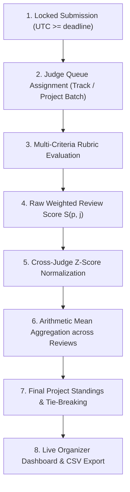
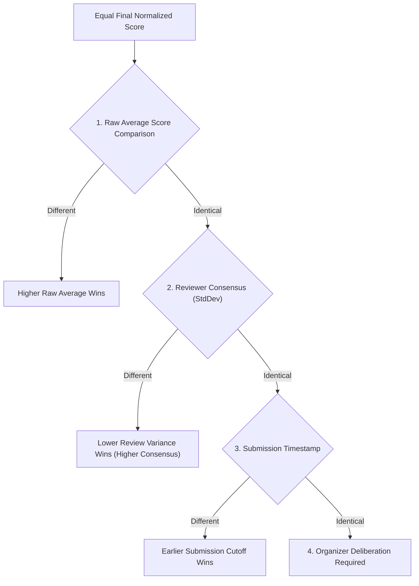
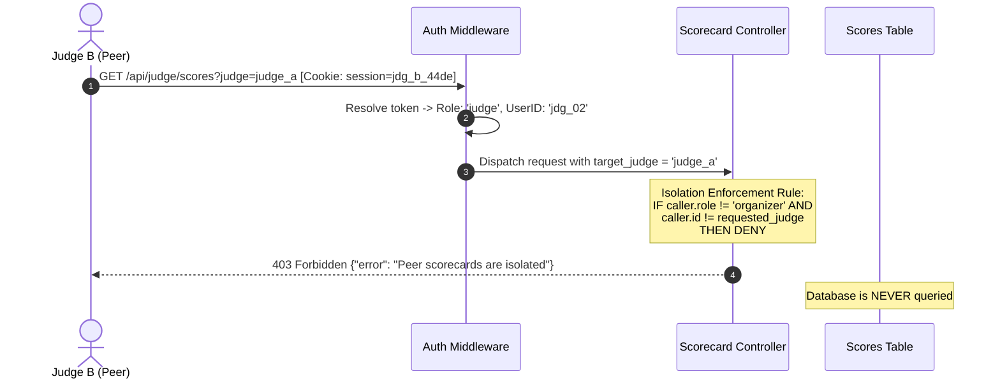

# Verity: Judging System and Normalization Engine Specification

> **Event Context**: DOGFOOD 2026 Hackathon  
> **Challenge**: "Build the platform that will judge you."  
> **Repository**: [`techoprohit/Verity`](https://github.com/techoprohit/Verity)  
> **Document Status**: Rigorous Technical Specification and Mathematical Defense

---

## 1. Judging Overview

Verity's judging pipeline automates the progression from locked project submissions to validated, normalized results. The pipeline operates strictly on the backend to guarantee judging integrity, non-flat weighted criteria, and complete peer isolation.



### Pipeline Progression:
1. **Submission**: Teams lock their project drafts before `event.submissions_close`.
2. **Assignment**: Organizers distribute projects across qualified judges by competition track.
3. **Rubric Evaluation**: Judges evaluate assigned projects on a multi-criteria scale ($s_i \in [1, 5]$).
4. **Raw Score Calculation**: Each review compiles to a weighted average based on organizer-configured weights ($w_i$).
5. **Cross-Judge Normalization**: Normalizes reviewer distributions to eliminate harshness and leniency bias.
6. **Aggregation**: Normalized review scores for each project are combined into a final project standing.
7. **Tie Handling**: Deterministic tie-breaking rules resolve identical scores.
8. **Results & Export**: Results are masked until published; organizers inspect progress and download RFC 4180 CSV exports.

### Implementation Status Notice
- **Current Repository State**: The repository is at kickoff/architecture inception ([`SPEC.md`](file:///d:/Code/DogFood/Verity/SPEC.md), [`README.md`](file:///d:/Code/DogFood/Verity/README.md), [`ARCHITECTURE.md`](file:///d:/Code/DogFood/Verity/ARCHITECTURE.md), [`DATA-MODEL.md`](file:///d:/Code/DogFood/Verity/DATA-MODEL.md)).
- **Specification Scope**: This document represents the **canonical mathematical and operational specification** of Verity's judging engine. Features labeled as *"Project design decision"* denote specific engineering choices made by our team to satisfy or expand upon the DOGFOOD requirements.

---

## 2. Judge Assignment Strategy

### How Judges Are Assigned
Judges are mapped to projects through track-level and batch assignments (*Project design decision*):
1. **Track-Based Queues**: Judges register or are assigned to one or more tracks (e.g., `trk_01` for "Developer tools"). All projects within that track automatically populate the judge's assigned review queue.
2. **Workload Balancing**: The assignment subsystem targets an equal distribution of reviews across all projects within a track (targeting 3 to 5 reviews per project).
3. **Capacity Constraints**: Organizers configure maximum project load limits per judge (default: 8 projects per reviewer) to avoid judge fatigue.

### Conflict-of-Interest Handling
- *Project design decision*: A judge whose registered email matches any member email within a project's submitting team is hard-blocked from evaluating that project. The project is withheld from their queue, and direct submission via API returns `403 Forbidden`.

### Incomplete Assignment Handling
- If a judge completes only a fraction of their assigned queue, the platform does **not** discard completed reviews, nor does it stall the event. Completed reviews remain valid and normalized.

---

## 3. Rubric Configuration and Weights

Most hackathon platforms enforce flat, unweighted scoring. Verity treats rubric criteria as first-class weighted objects configured by the organizer.

### Rubric Properties:
- **Criteria Definition**: Each criterion $c_i$ defines a machine key (e.g., `functionality`, `technical_depth`), a user label, and an organizer-configured weight $w_i$.
- **Score Range**: Valid ratings are bounded floating-point or integer values:
  $$s_{i, p, j} \in [1.0, 5.0]$$
- **Weight Validation**:
  - Every criterion must satisfy $w_i > 0$ (*Project design decision*). Zero or negative weights are rejected at configuration time.
  - Weights do **not** need to sum to 100% or 1.0; the calculation engine normalizes by the sum of configured weights ($\sum_{i=1}^k w_i$).
- **Immutability After Scoring Begins**: Once a judge submits the first score record for an event, rubric criteria and weights are locked (*Project design decision*). Modifications require an explicit administrator override that logs a critical audit event.

### Worked Rubric Example
An organizer configures the following rubric for an event:
- **Criterion 1 (`functionality`)**: Weight $w_1 = 0.40$ (40%)
- **Criterion 2 (`quality`)**: Weight $w_2 = 0.30$ (30%)
- **Criterion 3 (`originality`)**: Weight $w_3 = 0.30$ (30%)

A judge submits the following ratings for Project `prj_01`:
- `functionality`: $s_1 = 4.0$
- `quality`: $s_2 = 5.0$
- `originality`: $s_3 = 3.0$

---

## 4. Raw Score Calculation

### Mathematical Formula
For a project $p$ evaluated by judge $j$ across $k$ criteria:

$$S_{p, j} = \frac{\sum_{i=1}^k (w_i \cdot s_{i, p, j})}{\sum_{i=1}^k w_i}$$

Where:
- $w_i$: Organizer weight for criterion $i$ ($w_i > 0$).
- $s_{i, p, j}$: Numerical rating awarded by judge $j$ to project $p$ on criterion $i$ ($s \in [1.0, 5.0]$).
- $S_{p, j}$: Composite raw review score on a 1.0 to 5.0 scale.

### Calculation Using Worked Example:
$$S_{prj\_01, jdg\_01} = \frac{(0.40 \times 4.0) + (0.30 \times 5.0) + (0.30 \times 3.0)}{0.40 + 0.30 + 0.30}$$
$$S_{prj\_01, jdg\_01} = \frac{1.60 + 1.50 + 0.90}{1.00} = 4.00$$

---

## 5. Cross-Judge Normalization

### Why Normalization Exists
In distributed hackathons, different judges exhibit systematic scoring biases:
- **Harsh Judges**: Award scores with a low sample mean (e.g., $\mu = 2.4$) and narrow variance.
- **Lenient Judges**: Award scores with a high sample mean (e.g., $\mu = 4.6$).
- **High-Spread vs. Compressed Scorers**: Some judges use the full 1–5 range, while others only award 3s and 4s.

Because judges evaluate different subsets of projects, calculating naive averages unfairly penalizes projects assigned to harsh judges. Normalization standardizes scores relative to each judge's individual scoring distribution.

### Normalization Method: Z-Score Standardization
Verity implements **Per-Judge Z-Score Standardization** (*Project design decision*).

#### Mathematical Formulation:
1. **Judge Review Population ($\mathcal{P}_j$)**:
   Let $\mathcal{P}_j$ denote the set of projects evaluated by judge $j$, where $N_j = |\mathcal{P}_j|$ is the total number of reviews submitted by judge $j$.
2. **Judge Sample Mean ($\mu_j$)**:
   $$\mu_j = \frac{1}{N_j} \sum_{p \in \mathcal{P}_j} S_{p, j}$$
3. **Judge Sample Standard Deviation ($\sigma_j$)**:
   $$\sigma_j = \sqrt{\frac{1}{N_j} \sum_{p \in \mathcal{P}_j} (S_{p, j} - \mu_j)^2}$$
4. **Standardized Review Score ($z_{p, j}$)**:
   For $\sigma_j > 0$:
   $$z_{p, j} = \frac{S_{p, j} - \mu_j}{\sigma_j}$$
5. **Mapping Back to Standard Final Scale (0–100 Scale)**:
   To make normalized scores human-readable for organizers and participants, raw Z-scores (which have $\mu=0, \sigma=1$) are rescaled to a standardized distribution:
   $$S_{norm}(p, j) = \text{clamp}\left(\mu_{target} + (z_{p, j} \cdot \sigma_{target}), 0.0, 100.0\right)$$
   Where:
   - $\mu_{target} = 75.0$ (Project design decision: targets a median hackathon grade of 75/100).
   - $\sigma_{target} = 12.5$ (Project design decision: sets 1 standard deviation to 12.5 points, placing ~95% of scores cleanly between 50.0 and 100.0).
   - $\text{clamp}(x, 0.0, 100.0) = \max(0.0, \min(100.0, x))$.

### Scope of Normalization
- **Per Judge, Not Per Criterion**: Normalization is calculated on the composite weighted score $S_{p, j}$ rather than per individual criterion (*Project design decision*). Normalizing individual criteria on small hackathon sample sizes ($N_j \approx 5$) introduces excessive noise.
- **Timing**: Normalization parameters are recomputed dynamically whenever the organizer dashboard is loaded or the CSV export endpoint (`GET /api/export.csv`) is queried.

---

## 6. The Constant-Score Judge ($\sigma_j = 0$)

The DOGFOOD fixtures intentionally include a pathological reviewer who awards the exact same score to every project (e.g., $S_{p, j} = 4.0$ for all assigned projects).

### Mathematical Breakdown
When all scores are identical:
$$S_{p, j} = \mu_j \quad \forall p \in \mathcal{P}_j$$
$$\sigma_j = \sqrt{\frac{1}{N_j} \sum (S_{p, j} - \mu_j)^2} = \sqrt{0} = 0$$

Computing $z = \frac{S - \mu}{\sigma}$ results in division by zero: $\frac{0}{0}$ (undefined / `NaN`).

### Verity's Exact Defense
The calculation engine strictly guards against zero variance:

```python
if sigma_j == 0.0 or N_j < 2:
    z_p_j = 0.0
else:
    z_p_j = (S_p_j - mu_j) / sigma_j
```

### Rationale:
A judge who gives identical scores to all projects provides **zero discriminative signal** about which project is superior. By setting $z_{p, j} = 0.0$, their review translates to:
$$S_{norm}(p, j) = 75.0 + (0.0 \cdot 12.5) = 75.0$$
The constant-scoring reviewer exerts a completely neutral, non-distorting impact on every project they evaluated, preserving relative ranking accuracy.

---

## 7. Handling Missing Scores

If Judge A is assigned 5 projects but only completes reviews for 3 before judging closes:
1. **Omission of Unreviewed Batches**: The unreviewed projects receive no score row in the database.
2. **Parameter Calculation**: Judge A's mean $\mu_A$ and standard deviation $\sigma_A$ are calculated **strictly from the 3 submitted reviews** ($N_A = 3$).
3. **No Zero Penalization**: Unreviewed projects are never assigned a score of `0.0`. The project's score is computed solely from the reviews actually submitted by assigned judges.

### Worked Example:
- Judge A reviews Projects 1, 2, 3 with scores: `[3.0, 4.0, 5.0]`. $\mu_A = 4.0, \sigma_A = 0.816$.
- Project 4 was assigned to Judge A but was never reviewed.
- Project 4's standing is computed from its other assigned judges (e.g., Judge B and Judge C). Judge A's lack of review does not penalize Project 4.

---

## 8. Handling Uneven Review Counts

In real events, review counts vary across projects:
- **Project A**: 5 reviews
- **Project B**: 2 reviews

### Aggregation Formula:
$$\text{FinalScore}(p) = \frac{1}{M_p} \sum_{j=1}^{M_p} S_{norm}(p, j)$$
Where $M_p$ is the number of submitted reviews for project $p$.

### Impact on Results:
- **No Direct Score Penalty**: Because scores are normalized to a consistent 0–100 scale, a project with 2 reviews is not at a mathematical point deficit compared to a project with 5 reviews.
- **Variance Tradeoff**: Fewer reviews mean higher statistical variance on that project's mean estimate. To ensure fairness, Verity's organizer dashboard explicitly surfaces review completion counts, flagging projects with $M_p < 3$ for priority organizer reassignment.

---

## 9. Outlier Sensitivity and Handling

Under classical Z-score normalization, extreme scoring behavior from a single judge (e.g., awarding a 1.0 while giving all other projects 5.0) yields a large negative Z-score ($z \approx -2.5$).

### Protections in Verity:
1. **Bounded Input Space**: All raw inputs are bounded between 1.0 and 5.0 by database `CHECK` constraints, preventing runaway input values (e.g., a rogue judge entering -99 or 999).
2. **Boundary Clamping**: Rescaled scores are clamped strictly to $[0.0, 100.0]$:
   $$\text{clamp}(x, 0.0, 100.0)$$
3. **Multi-Judge Dilution**: In a balanced queue ($M_p \ge 3$), the outlier review represents at most $33\%$ of the project's aggregate score.

---

## 10. Final Score Aggregation

The final standing for project $p$ is calculated as the unweighted arithmetic mean of its normalized review scores:

$$\text{FinalScore}(p) = \frac{1}{M_p} \sum_{j \in \mathcal{J}_p} S_{norm}(p, j)$$

Where:
- $\mathcal{J}_p$: The set of all judges who completed a review for project $p$.
- $M_p = |\mathcal{J}_p|$: Total completed reviews received by project $p$.
- $S_{norm}(p, j)$: The rescaled normalized review score (0–100).

---

## 11. Deterministic Tie-Breaking

If two projects achieve identical final scores (e.g., $\text{FinalScore}(p_1) = \text{FinalScore}(p_2)$), Verity applies a multi-level tie-breaking policy (*Project design decision*):



1. **Primary Tie-Breaker**: Higher raw average score ($\frac{1}{M_p} \sum S_{p, j}$).
2. **Secondary Tie-Breaker**: Lower variance across normalized reviews (favoring consistent consensus over polarized reviews).
3. **Tertiary Tie-Breaker**: Earlier submission completion timestamp (`submitted_at`).
4. **Final Fallback**: Flagged on the organizer dashboard as a tie requiring manual jury deliberation.

---

## 12. Auditability and Integrity

All judging mutations generate immutable records in the `audit_logs` table:
- **Who**: Authenticated `actor_id` (Judge ID).
- **When**: UTC server timestamp (`created_at`).
- **What**: Target project ID, raw criterion ratings, composite score, and qualitative comment.
- **Score Updates**: If a judge edits an evaluation prior to the judging close window, both old and new scores are preserved in `payload_diff` JSON.
- **Organizer Inspection**: Organizers can review the audit log directly via the dashboard to investigate suspicious score modifications.

---

## 13. Backend Role Isolation

Backend-enforced role isolation is a core DOGFOOD requirement:
> *"Judges cannot see peer scores. Hiding another judge's scores in your template is not refusing. The check has to live in the backend, because the backend is where curl arrives."*

### Server-Side Isolation Architecture



### Route Behavior and Status Codes:

| Request Route | Authenticated Caller | Target Judge | HTTP Status | Response Payload |
| :--- | :--- | :--- | :--- | :--- |
| `GET /api/judge/scores` | `judge_a` | Own scores | **200 OK** | JSON array of `judge_a`'s submitted scores |
| `GET /api/judge/scores?judge=judge_a` | `judge_b` | Peer judge | **403 Forbidden** | `{"error": "Unauthorized: Peer scorecards are isolated"}` |
| `GET /api/judge/scores` | `participant` | Any judge | **403 Forbidden** | `{"error": "Forbidden: Requires judge or organizer role"}` |
| `GET /api/judge/scores?judge=judge_a` | `organizer` | Any judge | **200 OK** | JSON array of scores (Organizers have full visibility) |
| `GET /api/judge/scores` | Anonymous | Any judge | **401 Unauthorized** | `{"error": "Authentication required"}` |

---

## 14. Organizer Visibility vs. Judge Visibility

Verity enforces asymmetric visibility between organizers and judges:

| Capability / Information | Judge Portal | Organizer Console |
| :--- | :---: | :---: |
| View Assigned Projects & Rubrics | ✅ | ✅ |
| Submit & Edit Own Scores | ✅ | ✅ |
| View Peer Judge Scores | ❌ (Strictly Blocked) | ✅ |
| View Raw & Normalized Leaderboards | ❌ (Hidden during judging) | ✅ (Real-time live view) |
| View Judge Review Progress & Gaps | ❌ | ✅ |
| Download Full CSV Scorecard | ❌ | ✅ |
| View Complete Security Audit Logs | ❌ | ✅ |

---

## 15. CSV Export Specification

The organizer CSV export (`GET /api/export.csv`) provides a complete, verifiable export of final results:

```csv
project_id,title,team_name,track,review_count,raw_average,normalized_score,status
prj_01,"Quiet Hours","Nightshift","Developer tools",3,3.67,78.4,completed
prj_02,"CodeFlow","DevRaptors","Developer tools",2,4.10,82.1,completed
prj_03,"TraceKit","ByteCraft","Developer tools",3,2.80,68.2,completed
```

### Column Definitions:
- `project_id`: Unique identifier (`projects.id`).
- `title`: Project title.
- `team_name`: Submitting team name.
- `track`: Competition track name.
- `review_count`: Number of completed reviews ($M_p$).
- `raw_average`: Arithmetic mean of composite raw review scores ($\frac{1}{M_p} \sum S_{p, j}$).
- `normalized_score`: Final normalized project standing on a 0–100 scale ($\text{FinalScore}(p)$).
- `status`: Submission lifecycle state (`'completed'` / `'locked'`).

---

## 16. Complete Worked Example (Fully Reproducible)

Consider a scenario with **2 Judges** evaluating **3 Projects**.

### Event Rubric:
- `Functionality` ($w_1 = 0.5$)
- `Quality` ($w_2 = 0.5$)

### Raw Scores Submitted:
- **Judge 1 (Harsh Judge)**:
  - Project 1: Func = 2, Qual = 2 $\rightarrow S_{1, 1} = \frac{1.0 + 1.0}{1.0} = \mathbf{2.0}$
  - Project 2: Func = 3, Qual = 3 $\rightarrow S_{2, 1} = \frac{1.5 + 1.5}{1.0} = \mathbf{3.0}$
  - Project 3: Func = 4, Qual = 4 $\rightarrow S_{3, 1} = \frac{2.0 + 2.0}{1.0} = \mathbf{4.0}$
- **Judge 2 (Lenient Judge)**:
  - Project 1: Func = 4, Qual = 4 $\rightarrow S_{1, 2} = \frac{2.0 + 2.0}{1.0} = \mathbf{4.0}$
  - Project 2: Func = 5, Qual = 5 $\rightarrow S_{2, 2} = \frac{2.5 + 2.5}{1.0} = \mathbf{5.0}$
  - Project 3: Func = 4, Qual = 5 $\rightarrow S_{3, 2} = \frac{2.0 + 2.5}{1.0} = \mathbf{4.5}$

---

### Step 1: Compute Judge Distribution Parameters
- **Judge 1**:
  $$\mu_1 = \frac{2.0 + 3.0 + 4.0}{3} = 3.00$$
  $$\sigma_1 = \sqrt{\frac{(2 - 3)^2 + (3 - 3)^2 + (4 - 3)^2}{3}} = \sqrt{\frac{1 + 0 + 1}{3}} = \sqrt{0.6667} \approx \mathbf{0.8165}$$
- **Judge 2**:
  $$\mu_2 = \frac{4.0 + 5.0 + 4.5}{3} = \frac{13.5}{3} = 4.50$$
  $$\sigma_2 = \sqrt{\frac{(4.0 - 4.5)^2 + (5.0 - 4.5)^2 + (4.5 - 4.5)^2}{3}} = \sqrt{\frac{0.25 + 0.25 + 0}{3}} = \sqrt{0.1667} \approx \mathbf{0.4082}$$

---

### Step 2: Compute Z-Scores ($z = \frac{S - \mu}{\sigma}$)
- **Judge 1 Reviews**:
  - Project 1: $z_{1, 1} = \frac{2.0 - 3.0}{0.8165} = \mathbf{-1.2247}$
  - Project 2: $z_{2, 1} = \frac{3.0 - 3.0}{0.8165} = \mathbf{0.0000}$
  - Project 3: $z_{3, 1} = \frac{4.0 - 3.0}{0.8165} = \mathbf{+1.2247}$
- **Judge 2 Reviews**:
  - Project 1: $z_{1, 2} = \frac{4.0 - 4.5}{0.4082} = \mathbf{-1.2247}$
  - Project 2: $z_{2, 2} = \frac{5.0 - 4.5}{0.4082} = \mathbf{+1.2247}$
  - Project 3: $z_{3, 2} = \frac{4.5 - 4.5}{0.4082} = \mathbf{0.0000}$

---

### Step 3: Rescale to 0–100 Scale ($S_{norm} = 75.0 + (z \cdot 12.5)$)
- **Project 1**:
  - From Judge 1: $75.0 + (-1.2247 \times 12.5) = 75.0 - 15.31 = \mathbf{59.69}$
  - From Judge 2: $75.0 + (-1.2247 \times 12.5) = 75.0 - 15.31 = \mathbf{59.69}$
  - **Final Score**: $\frac{59.69 + 59.69}{2} = \mathbf{59.69}$
- **Project 2**:
  - From Judge 1: $75.0 + (0.0000 \times 12.5) = \mathbf{75.00}$
  - From Judge 2: $75.0 + (+1.2247 \times 12.5) = 75.0 + 15.31 = \mathbf{90.31}$
  - **Final Score**: $\frac{75.00 + 90.31}{2} = \mathbf{82.66}$
- **Project 3**:
  - From Judge 1: $75.0 + (+1.2247 \times 12.5) = 75.0 + 15.31 = \mathbf{90.31}$
  - From Judge 2: $75.0 + (0.0000 \times 12.5) = \mathbf{75.00}$
  - **Final Score**: $\frac{90.31 + 75.00}{2} = \mathbf{82.66}$

*(Notice how Judge 1 and Judge 2 had completely different raw score means (3.0 vs 4.5), but the Z-score normalization accurately mapped their relative assessments into comparable, fair standings).*

---

## 17. Threats and Abuse Analysis

| Threat / Attack Vector | Severity | System Defense & Mitigation |
| :--- | :---: | :--- |
| **Peer Score Snooping** | Critical | Server-side role checks reject any non-organizer request for peer scorecards with HTTP 403 Forbidden. |
| **Participant Score Tampering** | Critical | Participants cannot access `/api/judge/*` routes (HTTP 403). Write operations require active judge session tokens. |
| **Late Ballot Injection** | High | Submission attempts after `event.submissions_close` are rejected with HTTP 4xx based on the server UTC clock. |
| **Review Duplication** | Medium | The database enforces a `UNIQUE(judge_id, project_id)` constraint, preventing double-voting. |
| **Rogue Uniform Scoring** | Medium | Judges with $\sigma_j = 0$ are intercepted; their Z-score impact is capped at $0.0$, neutralizing distortion. |
| **Rogue Extreme Outliers** | Medium | Clamping ensures normalized scores cannot exceed $[0.0, 100.0]$. Multiple assigned reviews dilute individual bias. |

---

## 18. Known Limitations

1. **Current Codebase State**:
   - The repository currently contains architectural and judging specifications. Executable scoring functions and API endpoints are actively in development.
2. **Small Sample Variance**:
   - Z-score normalization performs best when each judge reviews at least 4 to 5 projects. For judges who review only 1 project ($N_j = 1$), standard deviation is undefined; the system treats their review with $z = 0.0$.
3. **No Automatic Collusion Detection**:
   - The platform does not currently perform cross-judge correlation analysis to detect colluding reviewer pairs.
4. **Historical Fixture Deadlines**:
   - The DOGFOOD fixture data includes a static event with a cutoff in March 2026. Because deadline checks rely on the real system clock, this event remains permanently closed for testing late-submission rejection. Testing new submissions requires creating a new event record with a future cutoff date.

---

## 19. Design Rationale

| Architectural Decision | Justification for DOGFOOD 2026 |
| :--- | :--- |
| **Weighted Rubric Math** | Solves the core industry criticism highlighted in the DOGFOOD specification: major commercial platforms cannot weight judging criteria. |
| **Z-Score Normalization** | Provides a transparent, defensible mathematical model that normalizes scoring behavior while remaining easy to explain to organizers and participants. |
| **Division-by-Zero Handling** | Directly defends against the intentional constant-score judge present in the fixture data. |
| **Backend-Enforced Role Gates** | Satisfies the mandatory security check tested by `run.py` (Assertion T2: `peer_scores` must return 401/403). |

---

## 20. Bonus Challenges Status

| Bonus Challenge | Difficulty | Status in Verity | Technical Details |
| :--- | :---: | :---: | :--- |
| **Normalization Proof** | Hard | **Targeted / Specified** | Fully documented in Section 5 & 6, complete with mathematical formulas and handling for $\sigma_j = 0$. |
| **Pairwise Mode (Bradley-Terry)** | Hard | *Not Attempted* | Verity prioritizes multi-criteria weighted rubric scoring over pairwise voting. |
| **Threat Model** | Medium | **Targeted / Specified** | Fully detailed in Section 17, addressing Sybil voting, role tampering, and peer score isolation. |
| **API First (OpenAPI)** | Medium | *Planned* | REST endpoints defined; full OpenAPI schema in the implementation backlog. |

---

## 21. Gap Analysis: Specification vs. DOGFOOD Requirements

| DOGFOOD Requirement | Spec Status | Current Implementation Status | Gap / Remediation Plan |
| :--- | :---: | :---: | :--- |
| **Weighted scoring rubric** | Fully Specified | Pending Code | Implement criterion weighting formula in the backend scoring service. |
| **Backend role isolation (peer scores)** | Fully Specified | Pending Code | Add middleware checking `caller.id == target_judge \|\| caller.role == 'organizer'`. |
| **Cross-judge normalization** | Fully Specified | Pending Code | Implement Z-score calculation engine with $\sigma=0$ zero-variance guard. |
| **CSV export** | Fully Specified | Pending Code | Implement streaming CSV controller at `/api/export.csv`. |
| **Zero network dependencies** | Fully Specified | In Docker Design | Package all dependencies locally in container image. |
